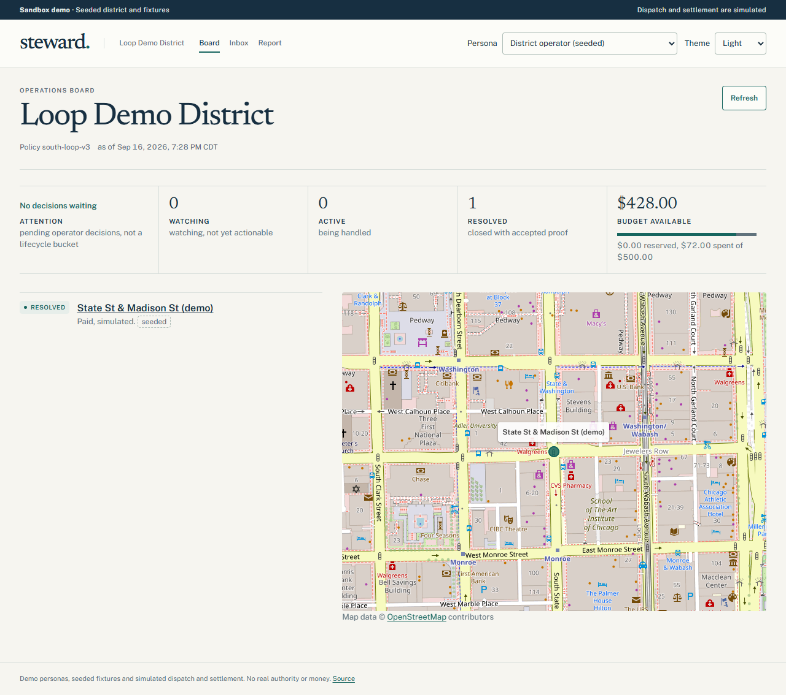
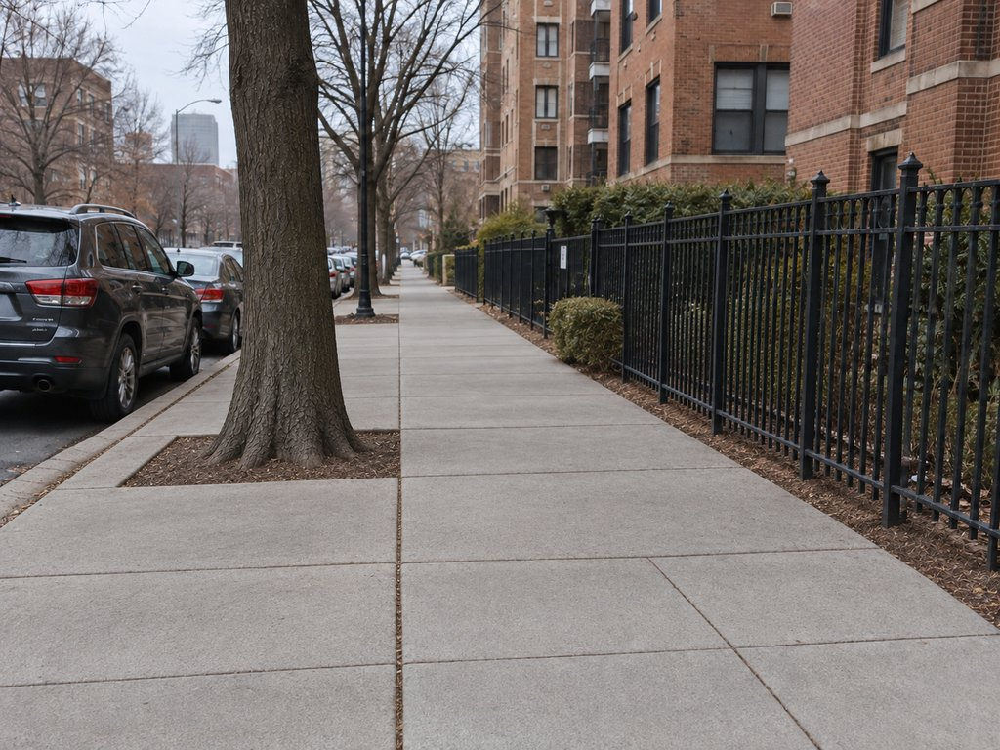
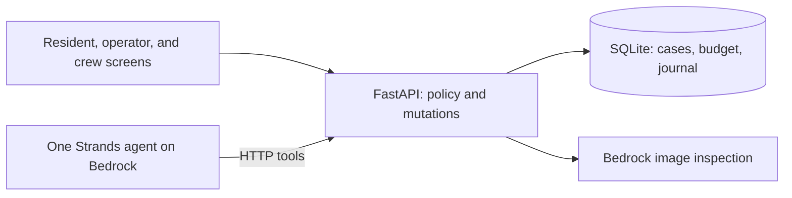

# Steward

**An AI agent that follows a neighborhood problem from report to verified cleanup.**

A service ticket says “completed.” A newer photo still shows a couch on the sidewalk. Who notices the mismatch, arranges the next step, and checks that the work actually happened?

I built Steward to explore that gap: an agent that investigates community reports, coordinates approved cleanup within a defined budget, and requires evidence of completion before allowing a simulated payment. It is an experiment in giving AI useful responsibility while keeping authority, money, and verification under explicit software rules.

Started for the **AWS Agents for Humans Hackathon**, Good Neighbor Agents track. I did not finish the full hackathon deliverables or submit an entry. The result is a working prototype of one carefully scoped scenario, kept here as a public project and a record of what I built and learned.

[Explore the demo](#explore-the-demo) · [How it works](#how-it-works) · [Run locally](docs/RUNNING.md) · [Architecture](docs/ARCHITECTURE.md)

*Prototype screenshot refreshed September 16, 2026 from a relocated replay of saved demo state. The Loop location and case are seeded; the $72 expense is simulated. This is not a new agent run. [Relocation notes](docs/evaluations/2026-09-16-loop-relocation.md).*

## The idea

Reporting a problem is only the beginning. Someone still has to connect duplicate observations, decide whether the issue persists, establish who can act, arrange work, and inspect the result. A closed record and a crew's completion claim can both disagree with the physical evidence.

My goal was to explore whether an agent could carry that context across the whole process, including knowing when to wait and when to bring a decision back to a person. I also used the project to learn Strands, Amazon Bedrock, and the practical work of hosting an agent-backed application on AWS.

The prototype focuses on **one dumped couch in a seeded Chicago neighborhood**. That small scenario makes the consequential decisions visible: conflicting evidence, spending permission, failed proof, human intervention, and eventual resolution.

## A walkthrough in one minute

| Reported condition | Incomplete cleanup | Accepted completion |
|---|---|---|
|  |  |  |
| Investigate the report | Deny simulated payment | Verify and resolve |

*These are synthetic test images, not photographs of a real service job. [Image provenance and generation prompts](data/images/PROVENANCE.md).*

1. **Wait for enough evidence.** The first report scores 65 against a 70-point action threshold. A seeded 311 record says the work is complete, so Steward records the conflict and waits.
2. **Reconcile the contradiction.** A second independent report raises the evidence score to 85. Two observations newer than the official completion confirm the dispute; crediting the matching record brings the score to 100.
3. **Arrange authorized work.** Steward selects an eligible provider. The API checks the district's authority and budget, calculates the fixed $72 quote, and reserves the funds for a simulated dispatch.
4. **Reject incomplete work.** The first completion proof scores 90 against 95 required. The API blocks payment and sends the exception to the operator.
5. **Resume after human direction.** The operator requests completion. Fresh proof scores 100, permitting one simulated payment and resolving the case. The $500 demo budget ends at $428 available.

The scores come from explicit rules over stored evidence and structured image findings; they are not model confidence percentages.

## Explore the demo

**Without running anything:** the board above and the [full issue-detail screenshot](docs/evaluations/ui/14-issue-1280-light.png) show the saved outcome. The [UI walkthrough](docs/evaluations/2026-09-14-ui-walk.md) includes desktop, mobile, light, and dark screenshots, with the evidence behind each step.

**Hosted sandbox:** the earlier deployment is recorded in the [hosting notes](docs/HOSTING_DECISION.md). Its location refresh is pending; use the screenshots or local guide to explore the updated Loop demo.

**Run a fresh scenario:** follow the [local setup and demo guide](docs/RUNNING.md). Live agent runs require your own AWS Bedrock access and incur inference costs. Offline tests and the scoring harness require no AWS credentials.

The persona switcher is a sandbox role selector, not production authentication. District authority, providers, budget, addresses, community feed, and the 311 record are seeded. Image inputs are synthetic. Agent and vision inference in the recorded live runs used real Bedrock calls; dispatch and settlement are simulated. No real municipal work or money is authorized.

## How it works

**Python · FastAPI · SQLite · Strands Agents · Amazon Bedrock · React · TypeScript · Vite**

The API schedules bounded agent invocations as events arrive. The agent interprets evidence and chooses tools; the service owns the records and decides whether each requested change is allowed. The image inspector returns structured findings, which deterministic code scores.

| Engineering decision | Why it matters | Where to look |
|---|---|---|
| Enforce policy at every mutation | A model's proposed action cannot bypass authority, budget, or completion requirements—even when the API is called directly | [Policy](src/agent/policy.py), [API](src/agent/api.py) |
| Keep state across invocations | Reports, decisions, pending work, and effects survive beyond one conversation | [Store](src/agent/store.py), [Runtime](src/agent/runtime.py) |
| Make spending transactional | Reservations and settlement are designed to prevent duplicate jobs or payments during retries and recovery | [Operations](src/agent/operations.py), [Recovery contract](docs/API.md#durable-processing-and-recovery-b12) |
| Separate interpretation from scoring | Vision findings feed inspectable rules; the model does not invent prices or award itself permission | [Vision](src/agent/vision.py), [Scoring](src/agent/scoring.py), [Verification](src/agent/verification.py) |
| Use the same HTTP boundary for agent and app | Policy stays in one service, with typed tools and actor-bound actions | [Agent tools](src/agent/tools), [Frontend](frontend/src) |

The recorded deployment used **EC2 + CloudFront**, retained EBS storage for SQLite and images, and private S3 backups. AgentCore and App Runner were planned but not deployed. The [architecture document](docs/ARCHITECTURE.md) and [hosting decision](docs/HOSTING_DECISION.md) explain the implemented topology and tradeoffs.

## What I built, and where I stopped

The repository contains the agent workflow, policy-enforcing API, persistent storage, proof inspection, demo driver, and five React surfaces: Operations Board, Issue Detail, Operator Inbox, Crew Form, and Resident intake.

The retained validation is dated **September 14, 2026**, rather than a claim that these checks ran again today:

- **16/16 local API acceptance criteria** in a repeated live Bedrock workflow. The UI was inspected against the resulting state; this does not establish a fully hand-driven browser run. [Acceptance and UI evidence](docs/evaluations/2026-09-14-ui-walk.md).
- **706 offline tests passed** on the clean-install candidate. [Clean-install receipt](docs/evaluations/2026-09-14-clean-install.md).
- **68 frontend tests passed** for the reviewed UI release. [Release receipt](docs/evaluations/2026-09-14-ui-release.md).
- **12/12 expected outcomes** in the narrow vision qualification check. This is a fixture-based component check, not a general accuracy benchmark. [Vision report](docs/evaluations/2026-09-13-vision-spike.md).

The broader 22-scenario evaluation, complete browser-driven acceptance, AgentCore integration, and final hackathon submission were unfinished. Hosted acceptance covered criteria 1–15 and persistence through service restart and instance reboot; hosted repeatability, instance replacement, and backup restoration remained unverified. [Hosted evidence](docs/evaluations/2026-09-14-hosted-acceptance.md).

This prototype demonstrates one controlled workflow. It does not establish production reliability, real-world image verification accuracy, or operational impact for a city or neighborhood.

## What this project taught me

The most useful part of the build was working out the boundary between an agent's judgment and the system's authority. Choosing to wait, refusing a payment, and resuming after a human decision needed as much care as the successful cleanup path. Persisted records and visible evidence made those choices possible to inspect after the agent finished running.

The next experiment would be broader evaluation on varied cases and images, followed by a fully browser-driven walkthrough. The larger neighborhood-operations concept lives in [VISION.md](docs/VISION.md); it is future direction, not shipped functionality.

## Dig into the project

- [Run locally](docs/RUNNING.md): installation, AWS configuration, seeding, reset, troubleshooting, and offline checks.
- [Product requirements](docs/PRD.md): original goals, actors, scope, and policy rules.
- [Architecture](docs/ARCHITECTURE.md): services, storage, tools, and deployment boundaries.
- [Model selection](docs/MODEL_SELECTION.md): role-specific model evaluation and qualification gates.
- [Documentation index](docs/README.md): build plans, evaluation protocols, and dated receipts. Hackathon deadlines and submission checklists are retained as historical context.

## License and provenance

[MIT](LICENSE). Built from a generic Strands/Bedrock starter, with project-specific agent, service, UI, and demo work added here. [Data and asset provenance](data/README.md) documents the seeded fixtures and synthetic inputs.
