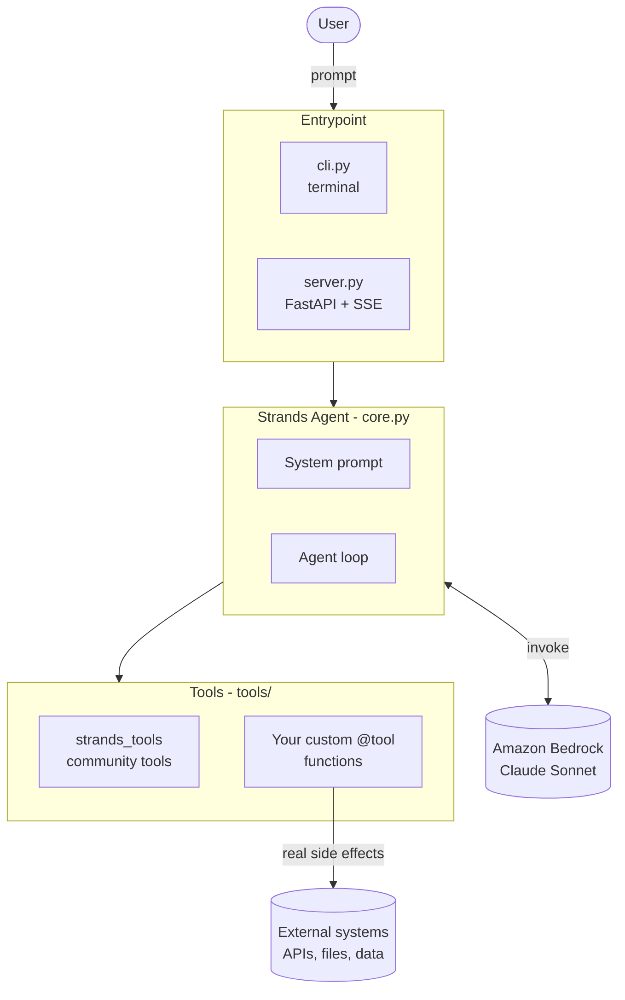

# Architecture

> An architecture diagram is a **required** submission artifact. Sketch the real
> shape of your system here once the design settles.
>
> Easiest paths: export from <https://excalidraw.com> or draw.io as PNG and embed
> it, or keep the Mermaid diagram below (GitHub renders it natively).

## Overview

**TODO: one paragraph on how the pieces fit together.**

## Components

| Component | File | Responsibility |
|---|---|---|
| Settings | `src/agent/config.py` | Environment-driven config (model, region, temperature) |
| Agent | `src/agent/core.py` | System prompt, model provider, tool registration |
| Tools | `src/agent/tools/` | The actions the agent can actually take |
| CLI | `src/agent/cli.py` | Interactive terminal loop |
| API | `src/agent/server.py` | HTTP + SSE streaming for the live demo |

## Key decisions

**TODO — the judges reward evidence of genuine understanding. Record the real
tradeoffs here as you make them:**

- Why this problem, and why an agent is the right shape for it
- Why these tools, and what each one is allowed to do
- Where a human stays in the loop, and why
- What the agent does when a tool fails
