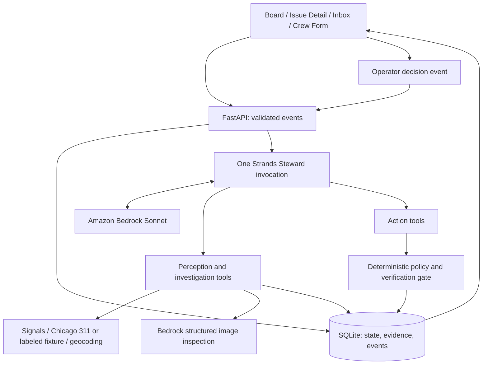

# Steward architecture and implementation contract

Status: **target design, not an implementation claim**. The repository currently contains a Strands/Bedrock terminal and FastAPI starter. Preserve `src/agent/` and extend it; a cosmetic directory migration has no value this weekend.

One Strands agent using Bedrock Sonnet chooses tools based on evidence and persisted context. API events start bounded invocations. Python code supplies facts and enforces permissions. SQLite is the V1 persistence default; no new cloud database is required for the couch proof.



Export the final, implementation-accurate diagram to `architecture.png` before submission. The Mermaid source is the editable diagram today.

## Boundaries

The model interprets messy signals, proposes issue matches and categories, reasons about contradictions and responsibility, chooses an eligible provider, and chooses its next tool. Deterministic code computes evidence scores, enforces authority and eligibility, calculates contract prices, reserves budget, checks verification, and permits or denies mutations.

Tool calls return source facts, structured findings, or policy results. They do not secretly run the entire couch script. A Strands policy/steering hook may improve agent feedback, but the action tool itself must enforce the same gate. API callers cannot bypass it.

## Tool contracts

| Tool | Returns or performs |
|---|---|
| `find_related_signals` | Candidate observations with identity/provenance and timestamps |
| `geocode_location` | Coordinates, precision/distance facts, live/seeded label |
| `search_311` | Matching records, official status, record times, source mode |
| `find_similar_issues` | Candidate canonical issues and supporting evidence |
| `classify_issue` | Structured category proposal and observable supporting facts |
| `determine_jurisdiction` | Responsibility proposal grounded in configured area/rules |
| `build_resolution_plan` | Service requirements, deterministic quote, verification requirements |
| `list_eligible_vendors` | Deterministically eligible provider facts |
| `inspect_completion` | Structured vision findings plus deterministic checks and score |
| `dispatch_vendor` | Policy-gated job and budget reservation; simulated dispatch event |
| `release_payment` | Policy-gated, idempotent simulated settlement |
| `close_issue` | Resolution only when current accepted evidence and job outcome permit it |
| `escalate_to_operator` | Persist exception and required decision; end invocation |

Persist signal linking, score updates, monitoring decisions, and official disputes through narrow validated state tools/helpers as needed. Tool names do not justify extra model calls; interpretation may occur in the orchestrator itself. Do not introduce a second agent or model for symmetry.

## Minimal data contract

Use stable IDs, UTC timestamps, explicit relationships, and integer cents for money. Location includes coordinates and provenance. Evidence belongs to an issue and, when applicable, a job.

| Entity | Fields |
|---|---|
| signals | id, source, raw_text, image, timestamp, reported_location, processed_at; source identity/provenance for independence |
| issues | id, category, location, status, evidence_score, official_status, created_at, resolved_at |
| issue_sources | issue_id, signal_id; unique link |
| vendors | id, name, insurance_verified, service_categories, service_area, equipment, availability, rate_card; seeded distance/workload/performance facts |
| jobs | id, issue_id, vendor_id, service_type, price, status, checkin_location, started_at, submitted_at, paid_at |
| evidence | id, issue_id, job_id, type, image, timestamp, location, model_findings; image hash and provenance |
| events | id, issue_id, job_id, event_type, timestamp, invocation_id, payload; append-only audit history |
| operator_decisions | id, issue_id, job_id, operator_id, decision, reason, timestamp, handled_at |
| payments | id, job_id, amount, status, timestamp, idempotency_key; simulated only |

Persist the demo budget and reservations in a small ledger/table or equivalent transactional record. Store policy version, score components, input evidence IDs, tool result, and concise decision explanation in event payloads. No hidden chain-of-thought. Current state and its audit event commit together; this is not a full event-sourcing framework.

Issue: `CANDIDATE → MONITORING → ACTIONABLE → RESOLUTION_ACTIVE → RESOLVED`.
Alternates: `DISPUTED`, `ROUTED_EXTERNAL`, `DUPLICATE`, `INVALID`, `ESCALATED`.
An official-record dispute is a timeline event/official-status fact and must not erase an active resolution workflow.

Job: `POSTED → ASSIGNED → CHECKED_IN → PROOF_SUBMITTED → VERIFIED → PAID`.
Alternates: `REWORK_REQUIRED`, `REJECTED`, `CANCELLED`.
A rework submission returns to `PROOF_SUBMITTED`. Failed proof remains unverified while an operator decision is pending; requesting completion sets `REWORK_REQUIRED`. Keep nuance in events.

## Evidence scoring

| Countable fact | Points |
|---|---:|
| Image evidence | 30 |
| Independent sources | 20 each, capped at 40 |
| Precise geocode within configured threshold | 15 |
| Matching service record | 15 |

Maximum 100; under 70 WATCH, at least 70 ACTIONABLE. These are evidence points, never model probability percentages. Seed distinct source identities and record precision criteria in policy. A repeated photo/message cannot manufacture independent corroboration. Actionable does not mean authorized to dispatch.

## Policy contract

```yaml
district: south_loop_demo
autonomous_categories: [litter, bulky_waste, approved_graffiti_removal]
route_to_city: [pothole, streetlight, traffic_signal]
never_dispatch: [electrical, structural, hazardous_material]
max_auto_dispatch_amount: 100 # dollars in human-readable policy; convert to cents
auto_pay_min_score: 95
```

The implementation adds an explicit demo service-area boundary, budget, actionable threshold 70, precise-geocode threshold, and GPS verification threshold 30m. Choose and document the geocode precision threshold during the fixture spike; do not infer a real SSA boundary from the district name.

Dispatch requires current actionable evidence, authorized category/location, eligible vendor, deterministic price at most $100, and sufficient unreserved budget. Refuse unknown authority, prohibited categories, and stale/unvalidated arguments. Settlement requires the latest accepted proof, policy threshold, valid job state, and no existing payment. Reserve once on dispatch, consume once on settlement; retries must not duplicate a job, reservation, or payment.

## Verification contract

Bedrock returns nullable booleans `same_scene`, `target_removed`, `no_new_hazard`, `area_clear`, plus concise observable findings. Unknown is not true.

| Check | Points |
|---|---:|
| GPS check-in within 30m of job | 30 |
| After timestamp later than before | 10 |
| Target removed | 40 |
| No new hazard | 10 |
| Area clear | 10 |

Maximum 100; automatic payment requires at least 95. Partial cleanup gives 90; complete cleanup gives 100.

**Prerequisite gate:** same scene must be true, required evidence present, no detected reuse, and no unresolved ambiguous findings. Scene mismatch/reused proof cannot pass merely by scoring 100. pHash detects reuse, not scene identity. V1 GPS/timestamp inputs are consistency checks, not production attestation. Missing, contradictory, or uncertain proof routes to manual review without settlement or resolution.

## Resume and failure behavior

Persist the pending exception, stop, accept an `OPERATOR_DECISION` event, and start a new invocation loading issue/job/evidence context. New crew proof likewise starts a new invocation. No immortal waiting session.

Use bounded invocation/tool retries. Live lookup failures return a labeled fixture only in demo mode; unavailable evidence never becomes a fabricated fact. Model failure or invalid structured output leaves the issue unresolved and records an error/review event. Replayed event IDs and payment requests are idempotent. The UI renders persisted events, not an invented transcript.
