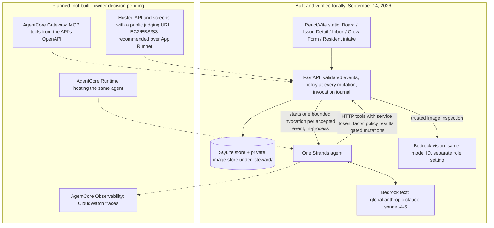

# Steward architecture and implementation contract

**As built, September 14, 2026.** The local system in this contract exists and is verified: FastAPI (`src/agent/server.py`) owns SQLite state, the private image store, policy at every mutation, the trusted vision inspector and the invocation journal; one Strands agent runs in-process per accepted event and reaches the API only through HTTP tools with a service token; Bedrock `global.anthropic.claude-sonnet-4-6` serves both the text and vision roles from a `us-west-2` client. The sixteen-step couch passed live through the API twice and once more on the screens ([DEMO.md](DEMO.md), [UI walk](evaluations/2026-09-14-ui-walk.md)). The hosted targets in the diagram below — AgentCore Runtime, Observability, Gateway and a public App Runner/EC2 URL — are **planned, not built**; the durable-hosting decision is open ([HOSTING_DECISION.md](HOSTING_DECISION.md)). The exported, implementation-accurate diagram is [architecture.png](../architecture.png) at the repository root; its editable source is [architecture.svg](architecture.svg). The sections that follow are the contract the code was built against; where they describe hosting, read them as the target.

Status as originally written, September 13: **target design with Tier 1A verified and Tier 1B policy/fixtures started**. The repository contained a Strands/Bedrock terminal and FastAPI starter plus validated signals, pure evidence scoring, and SQLite issue/source/event persistence. Preserve `src/agent/` and extend it; a cosmetic directory migration has no value this weekend.

Implemented foundation: `models.py`, `scoring.py`, `store.py`, and the explicitly offline `foundation.py` command. SQLite schema version 1 persists state and audit events in the same writer transaction. Source linking and supplied geocode/service-match facts update scores, not agent decisions or physical resolution. CANDIDATE remains until agent decision tools land. Identical signal retries have no additional effects and return current issue state; changed payloads or a second issue link conflict.

The JSON-compatible YAML `data/policy.yaml` now contains the v3 seeded scoring and dispatch configuration, validated by `policy.py`. Pure dispatch/settlement predicates exist; mutation endpoints and a ledger do not. The demo precision threshold is 30m; the harness seeds a 10m accuracy fact. Ten seeded addresses and the demo service boundary exist. Full job/ledger tables, actor event handlers, HTTP tool integration, and couch model/tool traces belong to subsequent slices. Tier 1A recorded live preflight/vision artifacts in [the vision spike report](evaluations/2026-09-13-vision-spike.md). Raw adapter facts in the store are not exposed as model-authoritative HTTP inputs. See [data provenance](../data/README.md).

One Strands agent using a selected Bedrock text model chooses tools based on evidence and persisted context. A separately configurable Bedrock image model supplies structured findings through the API's trusted inspection service. [MODEL_SELECTION.md](MODEL_SELECTION.md) defines candidates, observed results and qualification gates; Sonnet remains the current single-model default until the role settings and replacement gates are implemented. API events start bounded invocations. Python code supplies facts and enforces permissions. SQLite is the local V1 persistence default; hosted durability is the separate H1 decision.



`architecture.png` at the repository root is the exported diagram (rendered from [architecture.svg](architecture.svg) with headless Chrome); the Mermaid block above is the same picture in text form.

## Deployment topology

- **App Runner container (target; durability gate open)**: the FastAPI service enforces policy at every mutation, serves the built `frontend/` (React/Vite) as static files, and exposes the tool endpoints the agent calls. Local development uses SQLite. App Runner does not guarantee local files survive beyond one request, so container-local SQLite cannot satisfy the hosted persistence contract. Before tier 3, document a persistent state owner or an approved hosting adjustment and verify it across requests/restarts; reset/seed restores fixtures, not lost workflow state. See the [document review](reviews/2026-09-13-document-review.md) and [AWS storage contract](https://docs.aws.amazon.com/apprunner/latest/dg/develop.html).
- **AgentCore Runtime**: hosts the Strands agent. The API invokes it per reasoning-bearing event with the issue/job context; the agent's tools are HTTP clients of the API, authenticated with a service token. Locally the same agent runs against `localhost` (in-process or via `agentcore dev`), so there is one tool implementation.
- **AgentCore Observability**: traces and metrics to CloudWatch; the live trace for the sixteen-step run is retained as evidence.
- **AgentCore Gateway** (last in tier 3): an OpenAPI target against the App Runner service exposes the same operations as MCP tools. Tool names and schemas come from the FastAPI routes, so Gateway changes transport, not authority.

Build order and gates are in [PRD.md](PRD.md) section 4.5 and [BUILD_PLAN.md](BUILD_PLAN.md). H1's topology/storage recommendation starts at kickoff before database-specific assumptions are fixed; cloud implementation and proof still wait for tier 2 and the recorded owner decision. Local SQLite implementation stays behind the Store/API boundary while the hosted choice is reviewed.

## Boundaries

The model interprets messy signals, proposes issue matches and categories, reasons about contradictions and responsibility, chooses an eligible provider, and chooses its next tool. Deterministic code computes evidence scores, enforces authority and eligibility, calculates contract prices, reserves budget, checks verification, and permits or denies mutations.

Tool calls return source facts, structured findings, or policy results. They do not secretly run the entire couch script. A Strands policy/steering hook may improve agent feedback, but the action tool itself must enforce the same gate. API callers cannot bypass it.

## Tool contracts

| Tool | Returns or performs |
|---|---|
| `find_related_signals` | Candidate observations with identity/provenance and timestamps |
| `geocode_location` | Coordinates, precision/distance facts, live/seeded label |
| `search_311` | Matching records with status (OPEN, IN_PROGRESS, COMPLETED), record and completion times, source mode; one lookup per new signal, cached per issue |
| `find_similar_issues` | Candidate canonical issues and supporting evidence |
| `classify_issue` | Structured category proposal and observable supporting facts |
| `determine_jurisdiction` | Responsibility proposal grounded in configured area/rules |
| `build_resolution_plan` | Service requirements, deterministic quote, verification requirements |
| `list_eligible_vendors` | Deterministically eligible provider facts |
| `inspect_completion` | Structured vision findings plus deterministic checks and score |
| `dispatch_vendor` | Policy-gated job and budget reservation; simulated dispatch event |
| `release_payment` | Policy-gated, idempotent simulated settlement |
| `close_issue` | Resolution only when current accepted evidence and job outcome permit it |
| `escalate_to_operator` | Persist exception and required decision; end invocation |

Persist signal linking, score updates, monitoring decisions, and official disputes through narrow validated state tools/helpers as needed. Tool names do not justify extra model calls; interpretation may occur in the orchestrator itself. Use one text model for an invocation and the qualified image model for inspection; do not create a model call for each named tool. Model/profile selection is server configuration, never a model-supplied tool argument. Save actual role/model/prompt IDs with findings and decisions. Missing/invalid findings remain unresolved; no automatic retry-until-approved model cascade.

## Minimal data contract

Use stable IDs, UTC timestamps, explicit relationships, and integer cents for money. Location includes coordinates and provenance. Evidence belongs to an issue and, when applicable, a job.

| Entity | Fields |
|---|---|
| signals | id, source, raw_text, image, timestamp, reported_location, processed_at; source identity/provenance for independence |
| issues | id, category, location, status, evidence_score, official_status, created_at, resolved_at |
| issue_sources | issue_id, signal_id; unique link |
| vendors | id, name, insurance_verified, service_categories, service_area, equipment, availability, rate_card; seeded distance/workload/performance facts |
| jobs | id, issue_id, vendor_id, service_type, price, status, checkin_location, started_at, submitted_at, paid_at |
| evidence | id, issue_id, job_id, type, image, timestamp, location, model_findings; image hash and provenance |
| events | id, issue_id, job_id, event_type, timestamp, invocation_id, payload; append-only audit history |
| operator_decisions | id, issue_id, job_id, operator_id, decision, reason, timestamp, handled_at |
| payments | id, job_id, amount, status, timestamp, idempotency_key; simulated only |

Persist the demo budget and reservations in a small ledger/table or equivalent transactional record. Store policy version, score components, input evidence IDs, tool result, and concise decision explanation in event payloads. No hidden chain-of-thought. Current state and its audit event commit together; this is not a full event-sourcing framework.

Issue: `CANDIDATE → MONITORING → ACTIONABLE → RESOLUTION_ACTIVE → RESOLVED`.
Alternates: `DISPUTED`, `ROUTED_EXTERNAL`, `DUPLICATE`, `INVALID`, `ESCALATED`.
For the couch flow, an official-record dispute is always a timeline event/official-status fact, never a transition to `DISPUTED`; it must not erase an actionable or active resolution workflow. Reserve `DISPUTED` for a physical-outcome dispute outside an active workflow, unused in the mandatory V1 path. Use `ESCALATED` when human routing is needed and no routine resolution workflow is active. A payment exception on an active job leaves the issue `RESOLUTION_ACTIVE` and is represented by the pending exception.

Job: `POSTED → ASSIGNED → CHECKED_IN → PROOF_SUBMITTED → VERIFIED → PAID`.
Alternates: `REWORK_REQUIRED`, `REJECTED`, `CANCELLED`.
A rework submission returns to `PROOF_SUBMITTED`. V1 accepts new completion proof from `CHECKED_IN` or `REWORK_REQUIRED`; a pending completion exception blocks a new completion submission until the operator acts. Idempotent retries return the existing submission result. Failed proof remains unverified while an operator decision is pending; requesting completion sets `REWORK_REQUIRED`. Keep nuance in events.

## Evidence scoring

| Countable fact | Points |
|---|---:|
| Image evidence | 30 |
| Independent sources | 20 each, capped at 40 |
| Precise geocode within configured threshold | 15 |
| Matching service record | 15, per the service-record rule |
| Condition persists | 10, once per issue |

**Service-record rule.** `score_evidence` receives the matching record (status, completion time), not a boolean. OPEN or IN_PROGRESS credits 15 immediately. COMPLETED credits 0 and the store records a pending official conflict; once two independent observations newer than the completion time exist, the dispute is confirmed and 15 is credited. No match credits 0.

**Persistence rule.** A signal from an author who already has an observation on the issue, carrying a new image observed at least 24 hours after that author's previous observation, credits 10 once per issue. It never counts as a second independent source.

Under 70 WATCH, at least 70 ACTIONABLE. These are evidence points, never model probability percentages. Seed distinct source identities and record precision criteria in policy. A repeated photo/message cannot manufacture independent corroboration. Actionable does not mean authorized to dispatch.

## Policy contract

```yaml
district: south_loop_demo
autonomous_categories: [litter, bulky_waste, approved_graffiti_removal]
route_to_city: [pothole, streetlight, traffic_signal]
never_dispatch: [electrical, structural, hazardous_material]
max_auto_dispatch_amount: 100 # dollars in human-readable policy; convert to cents
auto_pay_min_score: 95
```

The seeded implementation supplies an explicit demo service-area boundary, a $500 budget, actionable threshold 70, precise-geocode threshold 30m, and GPS verification threshold 30m in `data/policy.yaml`. These values are locked by PRD section 4.2; do not infer a real SSA boundary from the district name. The PRD document version is independent of the `south-loop-v3` policy version.

Dispatch requires current actionable evidence, authorized category/location, eligible vendor, deterministic price at most $100, and sufficient unreserved budget. Refuse unknown authority, prohibited categories, and stale/unvalidated arguments. Settlement requires the latest accepted proof, policy threshold, valid job state, and no existing payment. Reserve once on dispatch, consume once on settlement, and release once if an unpaid job is cancelled; retries must not duplicate a job, reservation, or payment. Rework retains the same quote and reservation. A mixed prohibited hazard blocks ordinary cleanup; selecting a benign category cannot erase the hazard fact.

## Verification contract

Bedrock returns nullable booleans `target_present_before`, `same_scene`, `target_removed`, `no_new_hazard`, `area_clear`, plus concise observable findings. `target_present_before` is a prerequisite, not an extra scoring component: it prevents clean before-and-after evidence from authorizing payment for unestablished removal work. Unknown is not true.

| Check | Points |
|---|---:|
| GPS check-in within 30m of job | 30 |
| After timestamp later than before | 10 |
| Target removed | 40 |
| No new hazard | 10 |
| Area clear | 10 |

Maximum 100; automatic payment requires at least 95. Partial cleanup gives 90; complete cleanup gives 100.

**Prerequisite gate:** target presence in before evidence and same scene must be true, required evidence present, no detected reuse, and no unresolved ambiguous findings. Scene mismatch/reused proof cannot pass merely by scoring 100. Reuse means a perceptual-hash match between the new completion photo and previously submitted completion photos (this job and other jobs); the before photo is never in that comparison set, because a legitimate after photo of the same scene is expected to resemble it. Before-versus-after scene identity is the vision model's `same_scene` question, not a hash question. V1 GPS/timestamp inputs are consistency checks, not production attestation. Missing, contradictory, or uncertain proof routes to manual review without settlement or resolution.

## Resume and failure behavior

Persist the pending exception, stop, accept an `OPERATOR_DECISION` event, and start a new invocation loading issue/job/evidence context. New crew proof likewise starts a new invocation. No immortal waiting session.

Use bounded invocation/tool retries. Explicit demo mode may use labeled fixtures from the start, or as a labeled fallback after an actual live lookup failure; unavailable evidence never becomes a fabricated fact. Model failure or invalid structured output leaves the issue unresolved and records an error/review event. Replayed event IDs and payment requests are idempotent. The UI renders persisted events, not an invented transcript.
