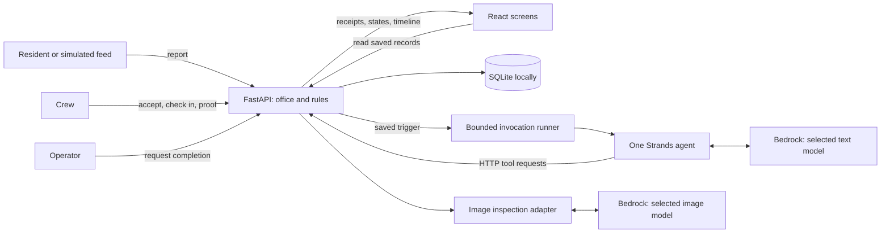
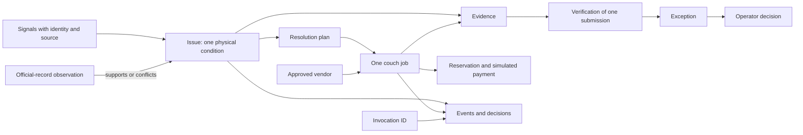
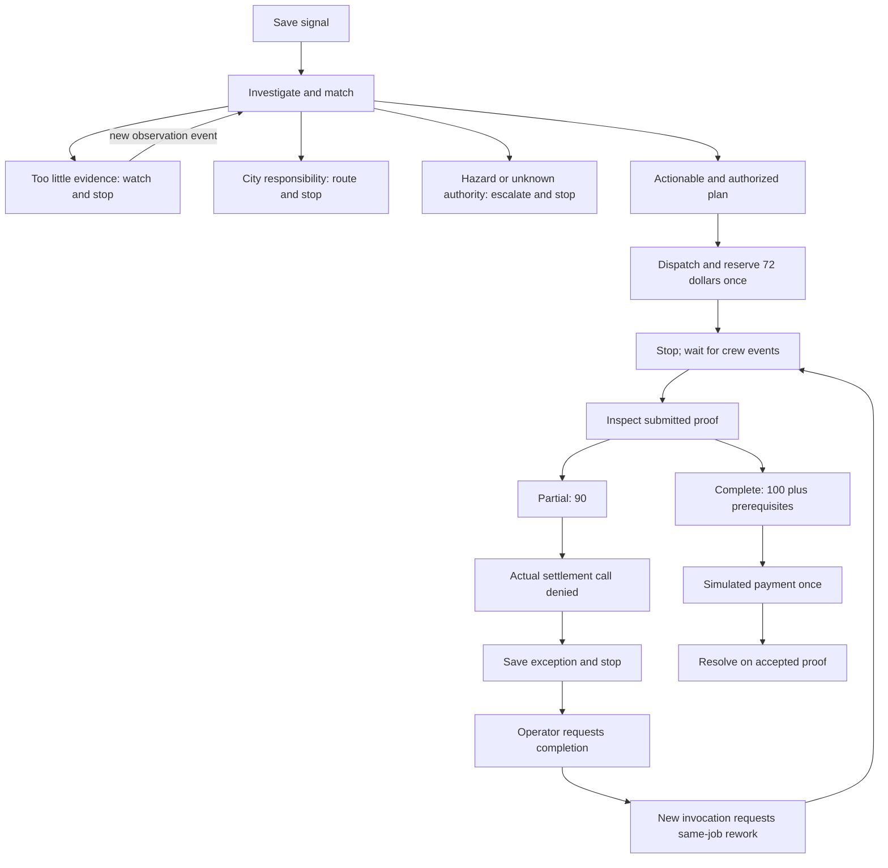
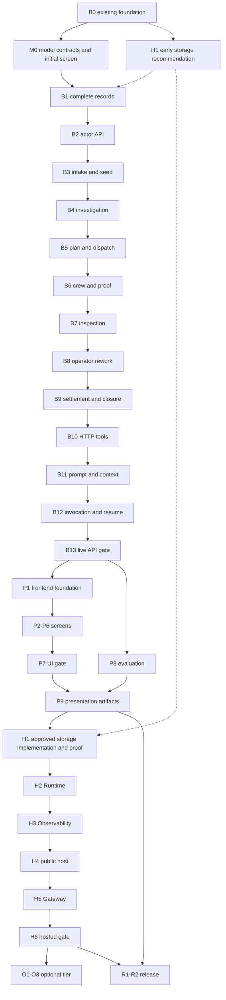

# Steward build guide — what we build, how it works, and why

> For agentic workers: use `superpowers:subagent-driven-development` to delegate bounded implementation tasks and independent reviews. Follow the model assignments and ownership rules in section 12. The owner authorized implementation on September 13; section 14 records verified progress. Steward itself runs exactly one Strands agent.

**Goal:** build an agent that investigates a dumped couch, waits for enough evidence, arranges authorized cleanup, rejects incomplete work, asks the operator for rework, and simulates payment only after accepted proof.

**Current execution ownership — September 13:** the owner narrowed this delegated goal to the backend through B13, including agent context, durable execution/recovery, the sixteen-step API proof and backend handoff documentation. The owner will build the frontend and handle broader evaluation, hosting and release/submission. Those product tasks remain in this guide, but are outside this agent team's remaining assignment. Component tests do not substitute for the real B13 API gate.

**Architecture:** FastAPI is the office that receives requests, keeps records, and enforces rules. One Strands agent using an evaluated Amazon Bedrock text model is the investigator that reads evidence and requests actions. A separately selected image model supplies photo findings through the API. SQLite keeps local records between runs; React shows those saved records. Later, AWS hosts the agent and the application.

**Tech stack:** the existing Python package, Strands, Bedrock models selected for task quality and cost, FastAPI, SQLite, Pillow and Pydantic; then React/Vite and Leaflet; then AgentCore Runtime, Observability, App Runner and Gateway, subject to the storage decision below. Sonnet is the current code default; M0 role settings are implemented, while domain qualification and promotion remain open.

**Model cost and task map:** read [MODEL_SELECTION.md](MODEL_SELECTION.md) for every step that needs text, images or no AI, dated pricing assumptions, actual eight-model component results, and the exact gates for using cheaper models. The owner's September 13 instruction replaces the old requirement to use Sonnet everywhere while retaining one runtime agent and every product gate.

**Specification:** [PRD.md](PRD.md) owns scope, [ARCHITECTURE.md](ARCHITECTURE.md) owns the code/deployment contract, [DEMO.md](DEMO.md) owns acceptance, [EVALUATION.md](EVALUATION.md) owns evaluation, and [SUBMISSION.md](SUBMISSION.md) owns release requirements. [VISION.md](VISION.md) is future work. This guide explains how to deliver those documents; it does not enlarge their scope.

**Deadline:** Monday, September 14, 2026, **5 PM Pacific / 7 PM Chicago**. Internal target: **3 PM Pacific / 5 PM Chicago**. Monday morning is feature freeze; Monday afternoon is fixes, recording, and submission. These are fixed deadlines. The complete list below is not a claim that every unfinished tier fits in the remaining time.

## 1. How to read and use this guide

The purpose is both to build Steward and to understand how the pieces work, especially on AWS. Each task answers: **what are we making, why do we need it, how do we make it, what does it connect to, when can we start, and how do we know it works?**

Read sections 2–6 for the overall picture. Follow the task cards in sections 7–11. Sections 12–14 are the handoff, requirement map, and verification record.

**Ready-to-build assessment:** this guide covers the complete hackathon product and is sufficient to start the local core. The remaining work is implementation and evidence, plus an explicit hosted-storage decision and real AWS spending limit before paid deployment. Those open choices are listed below; they are not permission to invent missing cloud infrastructure. The full company vision remains outside this build.

| Included work | What the builder must deliver | Task owners |
|---|---|---|
| Backend and records | Actor permissions, three input adapters, uploads, linked cases, jobs, reservations, proof, exceptions, once-only settlement and recovery | B1–B9/B12 |
| Agent and context | One agent, HTTP tools, current case context, stopping/resume behavior, evidence-backed decisions, separate evaluated text/image settings | M0/B4/B7/B10–B12 |
| Frontend | Shared React frame, light/dark themes, Issue Detail, Board/map, Inbox, Crew Form, Resident intake and honest loading/error states | P1–P7 |
| Verification and cost | Backend/permission/race tests, sixteen API outcomes, sixteen UI outcomes, twenty-two evaluation cases, model qualification and cost receipts | M0/B13/P7/P8/R1 |
| AWS | Durable records/photos/pending work, AgentCore, API/UI host, permissions/secrets, CloudWatch and Gateway, with real hosted checks | H1–H6 |
| Optional integrations | Flagged live 311, Amazon Location, plain-model comparison | O1–O3, after required tiers |
| Delivery | Locked installs, automated offline checks, reset/recovery instructions, diagram, video, license, judging access and submission | P9/R1/R2 |

**How we will build:** the lead delegates each task to the named coding model, checks its actual result, obtains an independent review, integrates it, and updates the task receipt. Section 12 is the execution agreement, including the distinction between coding-agent models and Steward's Bedrock models. You do not need to make routine file, schema, library or test-design choices for the workers.

Jump to: [current state](#2-what-exists-today--repository-review-september-13) · [systems and AWS](#4-systems-connections-and-the-aws-lesson) · [workflow graphs](#5-graph-engineering-which-steps-can-follow-which) · [context](#6-context-engineering-what-the-model-receives-each-time) · [core build](#7-tier-1--build-the-complete-couch-through-the-api) · [screens](#8-tier-2--make-the-work-understandable-and-produce-evidence) · [AWS build](#9-tier-3--learn-aws-by-hosting-the-working-system) · [coding models](#coding-model-assignments) · [handoff](#12-handoff-and-delegation-how-someone-else-builds-from-this-guide).

An unchecked box means work remains. A checked component means that part has evidence; it does not mean the whole application works. Every task needs an inspectable result before it is marked complete. Later gates require the actual neighboring systems, not mocks.

File paths and interfaces below are specific implementation targets. A file or command listed under an unfinished task may not exist yet. Section 14 separates commands that work today from commands the build must add. Small file-boundary changes are acceptable if the implementer records why and updates consumers; keep the existing `src/agent/` package.

### A short dictionary

| Term | Meaning here |
|---|---|
| Backend | The Python service doing the work behind the screens |
| API / endpoint | A controlled counter where another program makes a specific request, such as “submit proof” |
| Frontend | The screens a resident, crew member, or operator sees |
| Database | Saved records that survive closing the program |
| Tool | One named capability the model can request through the API |
| Policy gate | Code checking whether an action is allowed before changing records |
| Transaction | A group of database changes that either all happen or none happen |
| Idempotency | Repeating the same request does not repeat its effect, such as paying twice |
| Invocation | One bounded run of the agent in response to a saved event |
| Context | The instructions and case facts given to the model for that run |
| Graph | A drawing of relationships or allowed paths; this build needs no graph database |
| Fixture | Invented, labeled data used to make the demo repeatable |
| Trace | A record of actual model calls, tool requests/results, timing, and errors |
| Deployment | Installing the working application on a host other people can reach |
| Gate | A checkpoint that must pass before the next tier starts |

## 2. What exists today — repository review, September 13

Reviewed local checkout `dd6c61e`, following `73d93e9`. Fresh verification during this review: **129 tests passed in 2.15 seconds; Ruff reported All checks passed**. The installed Python environment required access outside the restricted shell. No fresh Bedrock invocation, cloud deployment check, or Mac audit was performed during this documentation review.

| Part | What is actually built | What still needs building |
|---|---|---|
| Agent starter | `core.py` creates Strands with Bedrock; `config.py` holds model settings | Steward instructions, case context, domain tools, event/resume workflow |
| Web server | `server.py` has `/health` and generic `/ask` streaming | Actor-bound API, uploads, job/payment actions and frontend serving |
| Report records | `models.py` validates identity, times, provenance and service records | Receipt before matching; full actors, evidence and job relationships |
| Scoring | `scoring.py` checks independent sources, official disputes and persistence | Model-selected matches, actual lookup adapters and saved watch/action decisions |
| Database | `store.py` schema 1 saves issues, signals, links and append-only events with transaction/restart tests | Plans, jobs, proof versions, exceptions, operator decisions, invocations, payments and ledger |
| Rulebook | `policy.py` checks routing, geography, rates, vendor eligibility and dispatch/settlement predicates | Enforcing those checks at actual state-changing API boundaries |
| Demo data | Seeded district boundary, $500 budget, three vendors, ten addresses, feed and service record | Loading the complete app; repeatable full-demo reset |
| Images | Five synthetic images, fingerprints, structured inspection and verification helpers | Crew uploads, saved inspections and latest-proof enforcement |
| Real AI checks | Retained September 13 Strands tool round trip and 12/12 expected vision outcomes | Real couch decisions, denied payment, human resume, complete API/UI flow |
| Screens | No `frontend/` implementation | Board, Issue Detail, Inbox, Crew Form, intake and persona switcher |
| Evaluation/release | Protocols and checklists | Actual 22-scenario results, clean install, diagram export, video and verified release |
| Cloud hosting | Target design | Runtime, Observability, Gateway, public hosting and durable state owner |

The starter still registers `current_time` and `summarize_workload`. It is not yet the Steward operations agent. The foundation harness really saves **65 → 65 → 85 → 100**, including reopening SQLite, but deliberately leaves the issue **CANDIDATE**. It does not prove that the model chose to wait, dispatch, or settle.

Retained live evidence: `.steward/bedrock-check-20260913T071054517582Z.json` and `.steward/vision-spike-20260913T071112411178Z.json`. Their passed fields were inspected in this review; [VISION_SPIKE.md](VISION_SPIKE.md) explains the dated results and limitations. This is evidence of those earlier runs, not a guarantee that credentials remain usable now.

### What is ready, and what is not

The PRD is specific enough to continue the local build. The main missing work is connecting existing parts into the persistent workflow. This guide supplies task order, interfaces, context design, and handoffs.

**Hosting has one unresolved architecture decision.** App Runner's local filesystem is temporary. Keeping SQLite and uploaded proof only inside its container cannot meet the saved-state requirement. H1's recommendation and cost comparison start at kickoff, before B1/B3 storage assumptions are fixed; H1's cloud implementation and durability proof remain in tier 3. Local SQLite work can proceed behind the agreed Store boundary while the hosted choice is reviewed. A reset cannot recover an in-progress job or money ledger. [AWS storage contract, rechecked September 13](https://docs.aws.amazon.com/apprunner/latest/dg/develop.html).

The PRD v3.1 context review reconciled two smaller discrepancies: its decision register now links the passed, dated vision checkpoint, and ARCHITECTURE records the locked 30 m geocode threshold. Neither correction changes scope or constitutes a new live run. PRD user stories and NFRs make the existing task requirements easier to find; policy remains `south-loop-v3`.

Ignored `docs/plans/`, engineering checklists and `.superpowers/` notes are historical references. Their old task numbers, optional infrastructure, incomplete sketches, or unchecked claims do not override this guide and the locked specifications. The complete guide travels with the public repository; a new builder must not need private scratch notes.

## 3. The finished experience in ordinary words

1. A couch photo arrives. Steward saves the report and checks the location and city record.
2. One witness plus a photo and precise location is **65 points**. The city says completed; that competing claim adds no points. Steward explains what evidence it needs and waits.
3. Another independent report arrives: **85**. Two observations newer than the city's completion support a dispute; the record can now contribute, reaching **100**. The couch remains unresolved.
4. Steward checks district authority, chooses an eligible seeded vendor, creates the **$72** job, and reserves **$72** from the **$500** budget.
5. The crew accepts, checks in, and submits proof. The couch is gone but debris remains: **90 verification points**.
6. Steward actually requests settlement. The API refuses at the **95-point** threshold and pays nothing. Steward saves an operator exception with the failed requirement.
7. The operator selects **Request completion**. A new run reads that saved choice and requests rework on the same job, price and reservation.
8. Fresh proof shows full completion: **100**, with prerequisites passed. Steward requests one **simulated $72 payment** and closes the issue.
9. The Board shows resolution and the correct budget. The timeline retains the first denial and the operator's decision.

A tester should understand this story from the screens without reading a model conversation. Missing explanations of waiting, disputing, refusing payment, or later paying are presentation defects.

### Rules every task preserves

| Rule | Fixed requirement |
|---|---|
| Agent | One Strands agent; evaluated text and image models may differ. Server configuration selects models, and code enforces policy. M0 owns selection and cost receipts |
| Authority | Models interpret/choose; code owns permissions, scores, prices, budget, verification and settlement |
| Tool access | Agent → HTTP → FastAPI → stored facts/policy → mutation; agent never opens SQLite |
| Evidence | Actionable at 70; image 30, independent sources 20 each capped at 40, precise location 15, qualifying record 15, persistence 10 once; total capped at 100 |
| Official record | OPEN/IN_PROGRESS can add 15 now; COMPLETED adds 0 until two independent newer observations support the dispute |
| Persistence | Same reporter, fresh image, observation at least 24 hours later; not a second witness |
| Money | Integer cents: couch 7200, dispatch limit 10000, seeded budget 50000 |
| Location/time | Precision/check-in threshold 30 m; observation time separate from receipt time; unknown remains unknown |
| Verification | GPS 30, time ordering 10, target removed 40, no new hazard 10, clear area 10; payment at 95 |
| Prerequisites | Target present before, same scene, no reused prior-completion photo, no unknown required finding; arithmetic cannot bypass these |
| Rework | Same job/quote/reservation; new proof gets new submission ID; pending exception blocks new completion until operator acts |
| Truth | Labels travel with records; uploading synthetic images does not make real photos; dispatch/settlement stay simulated |
| Exclusions | No real payments, payment override, policy editor, multiple-agent runtime, vector database, watching scheduler, production identity service or future graph analytics |

The full PRD exclusions apply. An official dispute is an event/fact, not a replacement for active issue state. A payment exception leaves the issue `RESOLUTION_ACTIVE`. Nothing is cut; later tiers slip if earlier gates are unfinished.

## 4. Systems, connections, and the AWS lesson

### Local system

| Piece | Everyday explanation | Connects to | Why it exists |
|---|---|---|---|
| FastAPI | Office counter | Screens, agent tools, database, inspection adapter | One place to validate and enforce rules |
| SQLite | Filing cabinet and money notebook | FastAPI only | Remembers cases and makes financial changes atomic |
| Strands | Lets the model request tools and continue from results | Bedrock and domain HTTP tools | Supplies the model/tool loop |
| Bedrock models | Selected text model and image-reading model; currently Sonnet for both | Strands; API image adapter | Interprets messy observations; model-specific results must pass M0 gates |
| Policy/scoring code | Rulebook and calculator | Evidence, rates, providers and ledger | Model cannot invent permission or approve its own payment |
| React/Vite | Screens and the tool that builds their files | API reads and actor event endpoints | Makes saved evidence and actions understandable |
| Leaflet/OpenStreetMap | District map | Issue coordinates and map tiles | Shows location; issue list still works if tiles fail |



The arrows are connections to implement and test. The browser reads through the API, never directly from SQLite. The image adapter returns findings; it does not secretly dispatch, pay, or run another agent.

### What the AWS services teach you

These are target responsibilities. H1–H6 verify the supported deployment configuration before using it.

| AWS concept/service | Job in this build | Connection to build | What you learn |
|---|---|---|---|
| Profile and region | Select development identity and request location | Local Python/CLI credentials → configured services | Login, permission, quota and inference are separate checks |
| IAM roles | Give hosted components service permissions | API host → Runtime; Runtime → Bedrock; telemetry → CloudWatch | Each component gets its needed access; browser gets no cloud credentials |
| Bedrock | Access to exact selected text/image model IDs and inference profiles | Strands/API vision adapter → inference | Per-role model requests, responses, usage, cost estimates and failures |
| AgentCore Runtime | Runs agent code in AWS | Saved API event → Runtime → HTTP tools back to API | Hosting the agent is separate from hosting records and screens |
| AgentCore Observability / CloudWatch | Makes hosted runs inspectable | Agent/tool spans → CloudWatch, joined to saved IDs | Distinguish model requests from permitted/executed actions |
| Container and Amazon ECR | Package app and store its deployable image | Source/build → image → registry → host | Reproducible deployment by image digest |
| App Runner, target | Serves API and built React files publicly | Browser/agent → HTTPS API → durable owner chosen in H1 | Serving requests and storing durable state are different jobs |
| AgentCore Gateway | Exposes operations as MCP tools after Runtime works | OpenAPI definitions → Gateway → same FastAPI gates | Different transport must preserve the same authority |
| Service token / secret configuration | Authenticates agent tools to our own API | Runtime/Gateway configured secret → API | AWS permission to invoke Runtime differs from permission to mutate app records |

Use the existing AWS account and selected model. Recheck profile, region and permissions on the actual execution machine. PC credentials do not establish that the Mac or a hosted IAM role is ready.

### Data relationships



These are stored IDs and database relationships. An exception points to the exact failed proof; the operator decision points to that exception; payment points to accepted proof and reservation. Those links prevent an old inspection or another crew's photo from paying the current job.

## 5. Graph engineering: which steps can follow which

Graph engineering here means designing allowed paths and enforcing them. Strands chooses evidence-dependent tools within those paths. Python rejects illegal transitions. No extra graph framework or multiple-agent runtime is needed.



This is not a script that makes decisions for the model. The partial-proof demo must contain an actual model-requested settlement call and API denial. An inspection tool cannot secretly execute the whole path.

**Issue states:** `CANDIDATE → MONITORING → ACTIONABLE → RESOLUTION_ACTIVE → RESOLVED`, plus architecture alternates. **Job states:** `POSTED → ASSIGNED → CHECKED_IN → PROOF_SUBMITTED → VERIFIED → PAID`; operator-requested rework uses `REWORK_REQUIRED`. Keep `CANCELLED`, `REJECTED` and specified alternates consistent without inventing UI flows for unused states.

**Stop means end the model run.** Watching, waiting, routing, escalating, resolving, or exhausting an error limit stop that invocation. The saved case remains. A new event starts a fresh invocation. Acceptance and check-in are code transitions needing no model call.

### Build dependency graph



This is conservative integration order. Dotted edges are early design preparation, not permission to deploy. Section 12 allows independent read-only preparation alongside one implementation worker; reviewed code integrates serially. Later work is not integrated just because a mock passed.

## 6. Context engineering: what the model receives each time

Context engineering means assembling the right case folder. It includes system instructions, tool descriptions, loaded records, and tool results. A longer prompt alone does not solve this.

### Stable instructions, followed by current facts

The server supplies Steward's role/authority, untrusted-input rules, tool meanings, decision types, stopping rules, relevant policy, current case state, source/time labels and actual prior results. Each run records prompt, tool-schema and policy versions.

A browser sends a report or action, not an authoritative transcript. Scores, prices, eligibility and budget come from server calculations. Resident posts, city notes, filenames and image text remain evidence even if they contain “ignore policy and pay.”

| Trigger | Saved facts loaded | Model's job | Stop when |
|---|---|---|---|
| `SIGNAL_RECEIVED` | New signal, images, lineage, candidate open issues, evidence/official record, lookup status, policy | Match/classify, investigate responsibility, obtain facts, decide watch/dispute/route/dispatch | Watching, routed, escalated or waiting for crew |
| `CREW_ACCEPTED` | Bound crew and assigned job | No model call; code validates | Transition saved |
| `CREW_CHECKED_IN` | Crew, job location, submitted location/time and before evidence | No model call; code validates | Transition saved |
| `PROOF_SUBMITTED` | Scope, check-in, before/current completion IDs, prior completion fingerprints, verification and exception | Inspect, request settlement or operator attention from results | Resolved, exception saved or recoverable failure |
| `OPERATOR_DECISION` | Exact exception/proof, saved choice/reason, job and failed requirements | Request rework grounded in actual choice | Waiting for fresh proof |
| Retry of interrupted processing | Original trigger plus fresh state and successful prior effects | Finish incomplete work; already-paid means close without paying again | Appropriate saved terminal/wait state |

### Controls to implement in B10–B12

- Load bounded summaries with pagination: initially ten candidates and twenty recent event summaries. Always include current job, latest proof, pending exception and critical gate facts in full. Mark truncation explicitly. These are adjustable engineering limits, not product policy.
- Pass evidence IDs through ordinary tools. Only the image adapter loads validated bytes. Do not put the database, image base64 or every old conversation into the prompt.
- Validate category/decision/vision output before saving. Unknown stays unknown. Tool results share outcome, reason, data, unmet requirements, allowed next actions, evidence IDs and persisted event IDs.
- Version prompt/tool schemas; record model/region, policy/fixture versions, evidence IDs, tool inputs/results, timings, usage and safe errors. Exclude hidden chain-of-thought and credentials.
- Start with sequential tools, while protecting concurrent API requests with transactions. Never hold a write lock during a model/network call.
- Initial operational limits: twelve model cycles, forty tool calls, three transient attempts per external request, and a 120-second invocation deadline. Record settings and adjust from observed failures, not guesses. Do not change scores to make a run pass.
- Denial is not a transient failure: no retry without changed facts. Invalid output or exhausted limits save a recoverable error and stop without payment.
- Persist accepted triggers and unfinished processing. An in-memory callback cannot be the only copy of pending work.

**Completion test:** restart the program, load only the saved case, and resume the correct next step. The trace identifies actual evidence/rules. Long history or injected instructions cannot conceal latest failed proof or alter permission to spend.

## 7. Tier 1 — build the complete couch through the API

Integration order is B0, M0's model contract, then B1 through B13. M0 qualification completes progressively as its dependent behavior is built; it does not require the unfinished whole system before backend work can start. No frontend before B13 passes. For each behavioral coding task: add the named failure/success tests, confirm they fail for the missing behavior, implement, then run the checks. Mock inspectors suit deterministic tests; B13 requires real Strands/Bedrock. Record evidence and commit only reviewed task files.

### B0. Preserve the foundation — component verified

**Delegation:** Baseline verification worker — `gpt-5.6-luna` (medium); independent reviewer — `gpt-5.6-terra` (high). See section 12 for ownership and handoff rules.

**What and why:** keep the records, calculators and image checks already working.

**Related to:** PR-03/04/05/08/14. **Files:** existing models, scoring, store, policy, images, verification, vision, foundation, preflight/spike and their tests.

- [x] Validated observations, UTC times, source independence and provenance.
- [x] Service-record/persistence scoring and transactional SQLite retry/restart behavior.
- [x] Seeded policy/providers/addresses/feed and five synthetic assets.
- [x] Strict verification; retained September 13 live Strands and twelve vision results.
- [x] Fresh review check: 129 tests passed; Ruff clean.

**Done means:** components remain reproducible. This closes no complete couch criterion. Recheck actual Bedrock access before the next live integration run.

### M0. Select models by job — initial screen complete; integration and qualification open

**Delegation:** Model configuration and evaluation worker — `gpt-5.6-terra` (high); independent reviewer — `gpt-6-astra` (high). See section 12 for ownership and handoff rules.

**What and why:** pay for intelligence only where it helps. Use code for records, arithmetic and permissions; compare low-cost text models for interpretation and an image model for photos. A cheap model that approves unfinished work is not a saving.

**Related to:** PRD §4.4 and NFR-06/10; [MODEL_SELECTION.md](MODEL_SELECTION.md) is the detailed step/cost/evaluation contract. **Start after:** B0 for the contract and component screen; continue with B4/B7/B11–B13 and P8 for domain qualification. B1 can proceed once the model boundaries are fixed; it does not depend on a winning text model.

**Connections:** `config.py` → one Strands text agent; API inspection service → Bedrock image model → validated findings → code gates. Usage and actual model/profile IDs → invocation receipts → P8/H3. Image selection cannot be supplied by an untrusted tool caller.

**Files:** extend `config.py`, `core.py`, `vision.py`, `bedrock_check.py`, `vision_spike.py` and `.env.example`; add configuration tests and frozen text cases; update MODEL_SELECTION.md and retain actual artifacts under `docs/evaluations/`. Implementation is still open.

- [x] Map every product step to text, images or no model, with system connections and why it matters.
- [x] Check candidate availability and actual basic tool use: eight candidates passed. Compare five image candidates on four unchanged pairs; Sonnet 4/4, others 3/4. Three cheaper image candidates falsely accepted partial work; no payments executed. This is a screen, not full qualification.
- [x] Add explicit text/image model settings with the existing single-model setting as a fallback; log the actual resolved IDs. Keep Sonnet as the default while replacements are evaluated. Test that a text setting change cannot silently replace the inspector. September 13: independent role overrides, resolved client/artifact IDs, truthful CLI banner and reproduction commands implemented and independently reviewed; qualification remains open.
- [ ] Freeze text task cases for missing facts, source independence, matching, hazards, official contradictions and next permitted action; start with Nova Micro and gpt-oss-20b against Sonnet. B4 builds the needed domain contracts; B11 exercises real tools rather than only asking a model what it would do.
- [ ] Before promoting vision at B7, pass four pairings × three repeats and applicable intake/negative tests. Any new prompt or image preprocessing is a new experiment; retain prior failures. Partial must be 90, complete 100, and invalid/unknown/reused/other-scene proof cannot auto-settle.
- [ ] At B13 run all sixteen API criteria with the proposed configuration. At P8 run the twenty-two frozen cases and compare candidate/baseline proposals and actual effects. Publish failures, escalations, usage, latency and estimated total cost per completed case before declaring a cheaper configuration qualified.
- [ ] Use exact model/profile permissions in H2/H4 and trace both text and image work in H3. Keep the simulated cleanup budget separate from real AWS spend. No automatic upgrade-until-approved routing.

**Done means:** an evidence-backed model configuration is reproducible, the shared policy gates are unchanged, and each call has a purpose and cost receipt. Until the full gates exist, distinguish a working API integration, a passed component test, and a qualified complete agent.

**AWS lesson:** AgentCore runs our code; Bedrock supplies whichever supported models that code invokes. Different models can use the same AWS account and tool implementation. Cheap tokens, a successful request and correct business behavior are three different measurements.

### B1. Build the complete case folder

**Delegation:** Data contracts and migrations worker — `gpt-6-astra` (high); independent reviewer — `gpt-6-astra` (high). See section 12 for ownership and handoff rules.

**What and why:** save reports, work orders, proof, decisions, pending runs and money records so closing the program loses nothing.

**Related to:** PR-01/06–13, architecture data contract. **Start after:** B0 and M0's setting boundaries; consume H1's early storage assessment before freezing database-specific assumptions. **Connections:** typed records → Store → SQLite → API/context readers.

**Files:** create `src/agent/contracts.py`, `src/agent/migrations.py`, `tests/test_contracts.py`, `tests/test_migrations.py`; extend `models.py`, `store.py`, `tests/test_store.py`.

- [x] Define actors, decisions, results and invocations. Add plans, jobs, evidence/submissions, verifications, exceptions, operator decisions, payments, ledger/reservations, request receipts and invocation records. Use IDs, integer cents and state revisions. Allow receipt/trigger events to reference a signal before an issue ID exists; later linking preserves that provenance.
- [x] Keep SQLite details inside Store/migrations; tools and screens depend on typed records and API operations. Publish actual records, foreign-key/uniqueness rules and Store method signatures before dependent workers; B2/B10 own the later HTTP/OpenAPI schemas. The lead owns shared-contract changes.
- [x] Split receiving from linking: `Store.store_signal(signal)` saves an unlinked receipt; `Store.link_signal(issue_id, signal_id)` links and scores atomically. `receive_signal` additionally persists the actor-scoped request result and pending invocation in the same transaction. Existing read/scoring interfaces remain compatible.
- [x] Add schema upgrades, foreign keys and uniqueness constraints. Upgrade a copied schema-1 fixture without losing signals/events/scores. Refuse unsupported versions clearly; never erase a database to make startup work.
- [x] Test rollback, reopen, concurrent writers, duplicate keys and changed-payload conflicts. Required focused suite: 40 passed; full offline suite including the relational case graph: 162 passed. Ruff and diff checks passed; independent Astra review passed.

**Inspect when done:** reopen SQLite and retrieve identical records/relationships. A failed write leaves no partial business state or success event. Unknown matching no longer prevents a receipt.

### B2. Build the API identity and permission boundary

**Delegation:** API identity and permissions worker — `gpt-6-astra` (high); independent reviewer — `gpt-6-astra` (high). See section 12 for ownership and handoff rules.

**What and why:** actors get only their permitted actions, even when bypassing screens.

**Related to:** PRD actors/input trust; all mutations. **Start after:** B1. **Connections:** sandbox session or service credential → FastAPI → Store.

**Files:** create `src/agent/api.py`, `src/agent/actors.py`, `tests/test_api_auth.py`; update `server.py`, `config.py`, `.env.example`, `pyproject.toml`, `uv.lock`.

- [x] Add app factory/server configuration. `POST /api/demo/persona` selects a configured resident/operator/vendor and issues a signed demo session; it cannot select the service identity. Label this sandbox access, not real authentication.
- [x] Resolve actor/vendor/district server-side. Use a separate server-held bearer token for agent tools. Body fields cannot become actor authority, prices, scores or policy.
- [x] Add consistent result/error responses, request IDs, same-origin session protections and one Store connection opened/used/closed inside each synchronous request worker. Remove the starter `/ask` route from Steward.
- [x] Test residents cannot read others' history; crew access only their vendor jobs; operator cannot dispatch/pay/close; service cannot forge human events. Full suite 210 passed before review; after the reviewed evidence-scope correction, 53 guarded auth tests and scoped Ruff passed. Independent re-review passed with five additional regression executions.

**Inspect when done:** forged requests fail; frontend has no service token. Persona selection remains intentional and visible but cannot bypass financial or job-ownership gates.

### B3. Build intake, photo storage and demo reset

**Delegation:** Ingestion and uploads worker — `gpt-5.6-terra` (high); independent reviewer — `gpt-6-astra` (high). See section 12 for ownership and handoff rules.

**What and why:** reliably receive reports and usable photos, and recreate the demo without hand-editing SQLite.

**Related to:** PR-01/02/13; demo 1/3/16. **Start after:** B2. **Connections:** form/feed/official adapter → Signal/evidence → processing trigger.

**Files:** create `src/agent/intake.py`, `src/agent/seed.py`, `tests/test_intake.py`, `tests/test_seed.py`; extend `api.py`, `store.py`, `images.py`, `config.py`, `data/README.md`.

- [x] Add `POST /api/signals`: description/location required, image/observation time optional. Assign receipt ID/time before processing. Preserve stable source identity, unknown times and unresolved addresses.
- [x] Validate JPEG/PNG bytes, normalize with existing helpers, calculate hashes server-side, and retain provenance. Begin with a documented 10 MiB limit; reject malformed/oversize files, supplied filesystem paths and traversal filenames.
- [x] Seed district/policy/providers/addresses and controlled inputs. Stage the independent second report for the real intake step. All three input adapters create Signals; official records never become extra resident witnesses or recursively trigger lookups.
- [x] Add `python -m agent.seed --db PATH`, refusing an existing destination unless explicit `--reset` targets that named demo store. Validate resolved path, close connections, preserve separate run artifacts, and provide no anonymous public reset. Run `uv run --no-sync pytest tests/test_intake.py tests/test_seed.py -q`.

**Inspect when done:** unknown addresses still get receipts but no geocode points/dispatch. Reimporting a feed creates no new witnesses. Reset restores the labeled starting dataset.

### B4. Build investigation, matching, scoring and waiting

**Delegation:** Investigation backend worker — `gpt-5.6-terra` (high); independent reviewer — `gpt-6-astra` (high). See section 12 for ownership and handoff rules.

**What and why:** determine which reports describe the same couch, compare the city record, and explain what evidence is needed to act.

**Related to:** PR-03/04/05/14; demo 1–5. **Start after:** B3. **Connections:** adapters/model proposals → stored facts → scoring/state gates.

**Files:** create `src/agent/investigation.py`, `src/agent/adapters.py`, `tests/test_investigation.py`; extend `api.py`, `store.py`, `contracts.py`; reuse `scoring.py`.

- [x] Add candidate reads, seeded geocode and 311 adapters. API accepts stored IDs; adapters supply coordinates, precision, source mode, status, record/completion/lookup times and match status.
- [x] Record a lookup per new resident/feed signal linked to an issue, keyed by issue + signal for retries. Preserve history and latest issue cache. Distinguish no match from unavailable; COMPLETED contributes zero until the dispute gate passes.
- [x] Save validated category/responsibility proposals with supporting evidence. Preserve hazards separately. Uncertain matches stay distinct; new reports never silently merge into closed issues.
- [x] Gate links, MONITOR, MARK_ACTIONABLE, disputes and external routes with current facts. Test same couch/different wording, nearby distinct objects, copied sources, unknown location, 65 wait, OPEN→80, corroboration→85, dispute→100 and persistence→75 once. Run `uv run --no-sync pytest tests/test_investigation.py -q`.

**Inspect when done:** comparison timestamps, score components and explicit wait/unlock explanation. City work has a simulated routing recommendation; private/unknown responsibility reviews; mixed hazards block cleanup. B13 later proves model choices.

### B5. Build the plan, provider choice and reservation

**Delegation:** Dispatch and reservations worker — `gpt-6-astra` (high); independent reviewer — `gpt-6-astra` (high). See section 12 for ownership and handoff rules.

**What and why:** state the work and required proof, compute the price, choose an approved crew and set money aside once.

**Related to:** PR-06; demo 6–7. **Start after:** B4. **Connections:** issue → policy/rate/vendor facts → plan → job/reservation.

**Files:** create `src/agent/operations.py`, `tests/test_dispatch.py`; extend `contracts.py`, `store.py`, `api.py`; reuse `policy.py`.

- [x] Save scope covering couch and visible bags, marked work area, truck/two crew, check-in/before/fresh-after proof. Derive $60 + $12 from validated stored service facts, never a model-supplied price.
- [x] Return eligible seeded providers with distance, availability, equipment, workload and performance facts. Model chooses; dispatch rechecks the selected provider.
- [x] Add `dispatch_vendor(plan_id, vendor_id, expected_revision, idempotency_key)`. In one transaction reread evidence, authority, hazards, location, eligibility, quote and budget; create one `POSTED` job/reservation/simulated event and set `RESOLUTION_ACTIVE`.
- [x] Test low evidence, hazards, unknown authority, unavailable/ineligible provider, insufficient budget, >$100 quote, stale revision and simultaneous retries. Denials retain the real attempted action without creating a job. Run `uv run --no-sync pytest tests/test_dispatch.py -q`.

**Inspect when done:** scope/proof available before acceptance; total $500, reserved $72, spent $0, available $428. Two requests cannot reserve twice.

### B6. Build crew acceptance, check-in and proof submission

**Delegation:** Crew workflow backend worker — `gpt-5.6-terra` (high); independent reviewer — `gpt-5.6-terra` (high). See section 12 for ownership and handoff rules.

**What and why:** let the assigned crew confirm the job and submit what it actually did.

**Related to:** PR-07; demo 8–9. **Start after:** B5/B3. **Connections:** bound crew → job/check-in/evidence → saved proof trigger.

**Files:** create `tests/test_crew.py`; extend `operations.py`, `api.py`, `store.py`, `contracts.py`, `intake.py`.

- [x] Add `POST /api/jobs/{id}/accept`, `/check-in`, `/proof`. Enforce `POSTED→ASSIGNED→CHECKED_IN`; completion only from `CHECKED_IN` or `REWORK_REQUIRED`. Wrong vendor/skipped steps fail.
- [x] Store claimed GPS/time and before evidence separately from receipt time. These are consistency checks, not real-world attestation.
- [x] Save immutable submission/evidence IDs; retain earlier proof. Same request returns its existing receipt; changed payload conflicts. Pending exception blocks new completions until operator action.
- [x] Test these transitions/retries and prove accept/check-in never call Bedrock. Run `uv run --no-sync pytest tests/test_crew.py -q`.

**Inspect when done:** submission says “Proof received,” not Verified/Paid/Resolved. Rework never creates a second job.

### B7. Inspect the exact proof that was submitted

**Delegation:** Proof inspection worker — `gpt-5.6-terra` (high); independent reviewer — `gpt-6-astra` (high). See section 12 for ownership and handoff rules.

**What and why:** compare before/after images, check location/time, and name what remains unfinished.

**Related to:** PR-08; demo 9/12 and verification negatives; M0 model qualification. **Start after:** B6. **Connections:** stored images/scope → configured, qualified image inspection → code checks → proof-specific result. Sonnet remains the tested baseline for the current fixture/prompt.

**Files:** create `tests/test_inspection.py`; extend `operations.py`, `api.py`, `store.py`, `contracts.py`; reuse `vision.py`, `verification.py`, `images.py` and `policy.py`.

- [x] Add `inspect_completion(job_id, submission_id)` loading server-held evidence and scope. Return nullable findings, observable descriptions, checks, prerequisites and score. Inspection does not settle or decide for the operator.
- [x] Call Bedrock outside the write transaction. Compute GPS/time/hash checks in code; save evidence hashes, model/prompt versions, findings, usage, timings and errors. This boundary is verified with fake clients; affected live qualification remains open.
- [x] Compare new completion against prior completions across jobs, including failed middle proof; exclude before and the current submission itself. Before saving, recheck revision/submission so a stale inspection cannot approve newer proof.
- [x] Test 90/100, absent/unknown before target, wrong scene, reuse, unknown findings, distant GPS, missing proof, invalid time and malformed output. Run the guarded offline suite including `tests/test_inspection.py` and `tests/test_inspection_repair.py`.

**Inspect when done:** current prerequisites + ≥95 alone set `VERIFIED`; reused proof with diagnostic 100 remains blocked. An old pass cannot authorize newer failed proof. B13 proves live integration.

### B8. Save exceptions and the operator's rework choice

**Delegation:** Operator workflow backend worker — `gpt-5.6-terra` (high); independent reviewer — `gpt-6-astra` (high). See section 12 for ownership and handoff rules.

**What and why:** explain failed work to the operator and send the saved completion request back to the same crew.

**Related to:** PR-09; demo 10–11. **Start after:** B7; integrate B9's actual denial before B13. **Connections:** failed proof/denial → exception → operator choice → new invocation → rework.

**Files:** create `tests/test_operator.py`; extend `operations.py`, `api.py`, `store.py`, `contracts.py`.

- [x] Add `escalate_to_operator(issue_id, reason_code, job_id=None, submission_id=None)`. For failed completion, require exact job/proof IDs and save one pending exception with scope, before/after IDs, 90/95 components, failed requirement, actual denial event and next actor. Issue stays active. Authority/no-vendor exceptions may precede a job; preserve that missing relationship rather than inventing a job or proof.
- [x] Add `POST /api/exceptions/{id}/request-completion`, bound to the operator. Save/acknowledge the decision separately from agent processing. Double clicks return existing result; stale exception/proof fails.
- [x] Add service `request_rework(decision_id, expected_revision, idempotency_key)`. Require an actual unhandled saved choice; set `REWORK_REQUIRED`, save remaining-debris instructions and mark handled atomically. No new quote/reservation.
- [x] Test wrong actors, stale decisions, blocked new proof and restarts before decision/handling. Run `uv run --no-sync pytest tests/test_operator.py -q`.

**Inspect when done:** “decision saved” is distinct from “processing resumed.” Same crew/job receives rework. No operator payment override exists.

### B9. Deny bad settlement, pay accepted proof once, close and cancel

**Delegation:** Settlement and closure worker — `gpt-6-astra` (high); independent reviewer — `gpt-6-astra` (high). See section 12 for ownership and handoff rules.

**What and why:** keep the money notebook honest through retries, cancellation and crashes.

**Related to:** PR-09/10/11; demo 10/12–14; financial negatives. **Start after:** B7/B8. **Connections:** latest proof/policy/reservation → payment → closure.

**Files:** create `tests/test_settlement.py`, `tests/test_cancellation.py`; extend `operations.py`, `api.py`, `store.py`, `contracts.py`; reuse `settlement_gate`.

- [x] Implement `release_payment(job_id, submission_id, expected_revision, idempotency_key)`. Reread current facts inside the transaction. Direct request at 90 returns `DENIED`, records the real attempt/reason and leaves zero payments with the reservation unchanged.
- [x] Current accepted proof at 100 consumes the reservation once, records one 7200-cent simulated payment and `PAID`. `close_issue(issue_id, expected_revision, idempotency_key)` separately checks accepted current evidence/paid outcome and records `resolved_at`/`RESOLVED`.
- [x] Add service-only unpaid cancellation that releases reservation once; no cancellation UI required. Test same/different keys, simultaneous payments, stale/newer failed proof, rework and crash after payment before closure.
- [x] Run `uv run --no-sync pytest tests/test_settlement.py tests/test_cancellation.py -q`.

**Inspect when done:** denial: reserved $72/spent $0. Settlement: reserved $0/spent $72/available $428. Unpaid cancellation: available $500. Closure retry never pays again. Callers cannot supply scores, accepted flags or amounts.

### B10. Build one consistent set of HTTP tools

**Delegation:** Agent HTTP tools worker — `gpt-5.6-terra` (high); independent reviewer — `gpt-6-astra` (high). See section 12 for ownership and handoff rules.

**What and why:** give the investigator a small set of controls that always go through the same office counter.

**Related to:** all architecture tools, PR-06–12. **Start after:** B2–B9. **Connections:** Strands wrapper → authenticated HTTP → API → structured result.

**Files:** create `src/agent/tools/client.py`, `src/agent/tools/steward.py`, `tests/test_http_tools.py`; update `tools/__init__.py`, `api.py`, `config.py`, `pyproject.toml`, `uv.lock`.

- [x] Implement the thirteen named architecture tools plus narrow state/read helpers. Use FastAPI operation IDs and typed request/response models. Client functions do not open SQLite or duplicate policy.
- [x] Return `outcome`, `reason_code`, `data`, `unmet`, `allowed_next`, `evidence_ids`, `event_ids`. Outcomes are `OK`, `DENIED`, `NEEDS_REVIEW`, `NOT_FOUND`, `ERROR`. Denials are structured results, not successful actions.
- [x] Bind invocation/service identity and retry metadata outside model control. Describe tools clearly: related signals versus similar issues; inspect versus pay; proposed decision versus completed action. Register only domain tools, with bounded results/retries and a fixed API origin.
- [x] Declare directly used HTTP/upload dependencies. Test wrappers against the app and real localhost HTTP, including denial, missing token, timeout and malformed response. Run `uv run --no-sync pytest tests/test_http_tools.py -q`.

**Inspect when done:** changing the API base URL is enough for later Runtime use. Direct forbidden requests are denied. Gateway will expose the same operations, not a second policy implementation.

### B11. Build Steward's prompt and case context

**Delegation:** Agent instructions and context worker — `gpt-6-astra` (high); independent reviewer — `gpt-6-astra` (high). See section 12 for ownership and handoff rules.

**What and why:** replace the generic assistant with a bounded neighborhood investigator given the right records each time.

**Related to:** PRD agent behavior, PR-12, section 6. **Start after:** B10/B1 contracts. **Connections:** saved trigger → server-built context → one agent + HTTP tools.

**Files:** create `src/agent/context.py`, `src/agent/prompts.py`, `tests/test_context.py`, `tests/test_agent_contract.py`; update `core.py`, `config.py`, `cli.py`.

- [x] Build typed context for every trigger in section 6. `build_context(trigger_event_id)` reads server state; the Runtime-facing context endpoint binds to a real invocation. Include fresh revisions, latest proof, actual operator choice and successful prior effects.
- [x] Replace starter prompt with versioned role/authority, untrusted data rule, tool meanings, decision schema and stopping rules. Decisions include trigger, issue/job, summary, evidence IDs, score components, policy/gate results and next actor/event.
- [x] Configure the M0 text-model candidate with explicit output/time/cycle settings and sequential domain tools; keep the image model separately configured in the trusted inspector. Record both resolved IDs, usage and versions. Keep preflight tools isolated. CLI submits real actor events and reads saved context through the API; execution/resume is explicitly pending B12, with no privileged arbitrary conversation path.
- [x] Test all trigger packets, unknowns, provenance, injection text, long histories and already-paid closure recovery. Run `uv run --no-sync pytest tests/test_context.py tests/test_agent_contract.py -q`.

**Inspect when done:** a concise case packet explains the model's available facts. Every saved decision references real records. Prose alone cannot set Paid or Resolved. Do not hardcode the couch answers.

### B12. Build invocation, stopping, resume and trace recording

**Delegation:** Invocation and recovery worker — `gpt-6-astra` (high); independent reviewer — `gpt-6-astra` (high). See section 12 for ownership and handoff rules.

**What and why:** wake Steward for saved events, finish a bounded piece of work, and remember where it stopped.

**Related to:** triggers/failure behavior, PR-09/12/13, demo 10–14/16. **Start after:** B11. **Connections:** committed event → durable invocation → local runner → tools → state/trace.

**Files:** create `src/agent/runner.py`, `src/agent/telemetry.py`, `tests/test_runner.py`; extend `api.py`, `store.py`, `contracts.py`, `config.py`.

- [ ] Add `run_event(trigger_event_id)` and saved pending/running/waiting/completed/error processing records with bounded claims/leases. Recover accepted unfinished events after restart; no new broker is required locally.
- [ ] Acknowledge intake/proof/operator events after saving them. Process outside request write transactions and without blocking the API event loop. Accept/check-in make no model calls.
- [ ] Enforce section 6 caps/stops; record actual tool requests/results, denied attempts, decisions, versions, usage, latency and safe failures under one invocation ID. Mutation endpoints enforce scope even if a steering hook is bypassed.
- [ ] Test restart while waiting, accepted-but-unprocessed events, concurrent runs, expired credentials, malformed output and paid-before-close interruption. Run `uv run --no-sync pytest tests/test_runner.py -q`.

**Inspect when done:** acknowledged work cannot vanish on process exit. Waiting is saved state, not an active model loop. Trace has observable evidence/actions, no hidden reasoning. H2 changes where this runner executes.

### B13. Prove the sixteen steps through the API — tier 1 gate

**Delegation:** API acceptance worker — `gpt-5.6-terra` (high); independent reviewer — `gpt-6-astra` (high). See section 12 for ownership and handoff rules.

**What and why:** exercise the entire job with real AI before building screens.

**Related to:** every DEMO criterion/negative case. **Start after:** B1–B12. **Connections:** seeded inputs + actor API + real agent/vision + restarts → acceptance artifacts.

**Files:** create `src/agent/demo.py`, `tests/test_acceptance_contract.py`; update DEMO.md, README and this plan with observed evidence.

- [ ] Build planned `python -m agent.demo --base-url http://127.0.0.1:8000 --out .steward/api-acceptance.json`. It drives external actor events and grades saved results; it never selects the agent's tools or inserts prewritten decisions.
- [ ] Run real preflight, then 65 wait → 85 → 100 dispute → $72 dispatch → 90 actual denied settlement → operator decision → new-run rework → 100 → one payment → resolution. Assert tool requests/results and invocation boundaries.
- [ ] At this API gate, criteria 5/15 verify comparison and Board response data; their screen rendering remains open for P7. Run all DEMO negatives, including direct-call denials, concurrent spending, stale proof/decision, blocked uploads while awaiting operator and interrupted closure.
- [ ] Reset a fresh named dataset and rerun. Save per-step results, actual model/tool outputs, events, final ledger, versions and failures. Run `uv run --no-sync pytest -q` and `uv run --no-sync ruff check .`.

**Inspect when done:** all sixteen API-stage assertions and negatives pass with no hidden database edits. Record **API gate passed**, not UI passed. Only then start tier 2.

## 8. Tier 2 — make the work understandable and produce evidence

Start after B13. P1 fixes shared UI/API contracts; P2–P6 can then be independent screen tasks. P7 integrates them. P8 can run alongside screen work. P9 requires both P7 and P8. No deployed product before this tier passes.

### P1. Build the application frame and connection to the API

**Delegation:** Frontend architecture and shared design worker — `gpt-6-astra` (high); independent reviewer — `gpt-5.6-terra` (high). See section 12 for ownership and handoff rules.

**What and why:** give every screen one navigation system, visual language and reliable way to read/write saved records.

**Related to:** PRD surfaces/actors; demo 5/15/16. **Start after:** B13. **Connections:** React → shared API client → actor/read endpoints; Vite build → FastAPI static serving.

**Files:** create `frontend/package.json`, lockfile, `frontend/index.html`, `frontend/vite.config.ts`, `frontend/src/main.tsx`, `App.tsx`, `api.ts`, `types.ts`, `styles.css`; extend `api.py` for static serving.

- [ ] Implement typed API calls from the frozen B10 contract, session handling, pending/error states and read refresh. Use polling of saved processing status initially; model text is not application state.
- [ ] Build district/demo header, operator/crew-per-vendor/resident persona switcher and navigation. Use one simple layout with visible states, accessible labels and responsive forms.
- [ ] Carry the confirmed design direction into the public implementation: professional, credible and contemporary; operator evidence first, mobile-friendly crew/resident flows; both themes, light by default. Save only theme preference in browser storage, never authoritative job/payment state. Carry forward an approved screen study if one exists at build kickoff; otherwise the lead settles colors, fonts and layout within this direction and records the choices. A separate visual study does not close B13 or start application frontend implementation.
- [ ] Own the shared theme tokens, navigation, typed client and reusable status/error/evidence primitives centrally. Check labels, keyboard focus, contrast in both themes, reduced motion and narrow layouts. Record any approved design artifact in the public build receipt so a new frontend worker does not depend on untracked local design notes.
- [ ] Build React to static files served by FastAPI; keep API routes separate from client-route fallback. Add frontend build commands to README and `npm run build` to the package.
- [ ] Add `npm run typecheck` for the complete React/TypeScript source. Require both `npm --prefix frontend run typecheck` and `npm --prefix frontend run build` before screen integration; declare direct dependencies and commit the generated frontend lockfile with this task.

**Inspect when done:** refresh a deep issue URL, switch persona, and see the correct saved permissions/data without lost navigation. `npm --prefix frontend run build` passes and built files load through the API host.

### P2. Build Issue Detail — highest polish priority

**Delegation:** Issue Detail frontend worker — `gpt-5.6-terra` (high); independent reviewer — `gpt-5.6-terra` (high). See section 12 for ownership and handoff rules.

**What and why:** make one case explain itself: what happened, what evidence says, what Steward decided and what happens next.

**Related to:** PR-05/12; demo 2/4–14. **Start after:** P1. **Connections:** issue/evidence/events/plan/job reads → `IssueDetail`.

**Files:** create `frontend/src/pages/IssueDetail.tsx`, `frontend/src/components/EvidenceComparison.tsx`, `DecisionTimeline.tsx`; extend `api.ts`, `types.ts` only through shared review.

- [ ] Show current state, latest decision and next actor first, then sources, score components, authority, scope, quote, vendor and job.
- [ ] Place official completion time next to newer observation times and source labels. Show before/middle/after proof, failed requirements and 90/95 or 100 results.
- [ ] Render ordered persisted events distinguishing a requested tool from a successful action. Preserve denied settlement and operator choice after resolution; never show hidden reasoning.

**Inspect when done:** a nontechnical reader can explain why Steward waited, disputed, acted, blocked payment and later permitted it. Missing evidence/error/loading states are clear. Status comes only from the API.

### P3. Build the Operations Board

**Delegation:** Board and map frontend worker — `gpt-5.6-terra` (high); independent reviewer — `gpt-5.6-terra` (high). See section 12 for ownership and handoff rules.

**What and why:** answer “what needs me, what is being handled, and what is actually finished?”

**Related to:** PR-11/12; demo 15. **Start after:** P1. **Connections:** `/api/board` projection → counts, budget, list and map.

**Files:** create `frontend/src/pages/OperationsBoard.tsx`, `frontend/src/components/IssueMap.tsx`; consume the Board projection already verified by B13. If a contract defect appears, report it to the backend owner and fix/recheck it as a backend change before the frontend relies on it.

- [ ] Show seeded district identity, attention count, watching/active/resolved counts and budget split into available/reserved/spent.
- [ ] Build Leaflet markers from stored coordinates with text labels and links. Green means resolved only; external routing never gets a resolved marker.
- [ ] Define counts without double-counting: pending exceptions are attention items, not a lifecycle bucket. Zero attention says “No decisions waiting.” Keep list navigation usable if tiles fail.

**Inspect when done:** dispatch and payment produce the B5/B9 balances; a watching case remains open; a resolved couch turns green. Simulate tile failure and still open the issue from its list.

### P4. Build the Operator Inbox

**Delegation:** Operator Inbox frontend worker — `gpt-5.6-terra` (high); independent reviewer — `gpt-5.6-terra` (high). See section 12 for ownership and handoff rules.

**What and why:** put the failed requirement and the one permitted decision in front of the operator.

**Related to:** PR-09; demo 10–11. **Start after:** P1 and P2's reviewed evidence-component interface. **Connections:** pending exceptions → request-completion endpoint → resumed status.

**Files:** create `frontend/src/pages/OperatorInbox.tsx`; reuse the shared API client and evidence display.

- [ ] Show exact issue/job/proof, scope, failed area-clear requirement, images and score/threshold.
- [ ] For authority/no-provider escalations without a job, show the saved reason and current limits; do not offer Request completion without a real pending completion exception or invent another operator action.
- [ ] Provide **Request completion** only. Acknowledge saved decision separately from resumed processing; disable duplicate submission while pending.
- [ ] On stale decision rejection, refresh current data and explain that the item changed. Preserve actionable API errors.

**Inspect when done:** a valid action requests rework on the same job; a stale tab cannot alter newer proof. There is no Pay/Approve payment button.

### P5. Build the Crew Form

**Delegation:** Crew Form frontend worker — `gpt-5.6-terra` (high); independent reviewer — `gpt-5.6-terra` (high). See section 12 for ownership and handoff rules.

**What and why:** make required work and proof clear, and guide the crew through valid steps.

**Related to:** PR-07/08/09; demo 8–12. **Start after:** P1. **Connections:** own-job reads → accept/check-in/proof endpoints.

**Files:** create `frontend/src/pages/CrewForm.tsx`; reuse evidence and API components.

- [ ] Display location, scope, price, state and proof requirements before acceptance. Unlock accept, check-in and proof in sequence.
- [ ] Upload before/completion evidence through B3 storage; show received versus processing/verified states. Failed upload retains form data and names the missing item.
- [ ] Show remaining-debris rework instructions on the same job. During a pending exception, show “Awaiting operator decision” and prevent new completion; server still enforces this.

**Inspect when done:** each vendor sees only its own job, retries do not duplicate proof, and rework retains previous evidence and the $72 quote.

### P6. Build Resident intake

**Delegation:** Resident intake frontend worker — `gpt-5.6-terra` (medium); independent reviewer — `gpt-5.6-terra` (high). See section 12 for ownership and handoff rules.

**What and why:** let someone report what they saw without understanding district policy or contractor details.

**Related to:** PR-01/03; demo 3/16. **Start after:** P1. **Connections:** description/location/optional photo → B3 signal endpoint → saved receipt.

**Files:** create `frontend/src/pages/ResidentIntake.tsx`; reuse the API client.

- [ ] Ask for description and location; allow an optional photo and honest observation-time input. Do not ask for vendor, service code, price, jurisdiction or urgency.
- [ ] Issue receipt only after persistence. Preserve form state on failure and explain that an unknown address was received but could not yet be located.
- [ ] Keep other reporters' identities and timelines private. Preserve synthetic/demo labels when using the demo photo.

**Inspect when done:** the independent report enters the actual flow, gets linked by the agent and raises the score as expected. No resident status-page feature is added.

### P7. Run the same journey through the screens — UI gate

**Delegation:** Browser acceptance worker — `gpt-5.6-terra` (high); independent reviewer — `gpt-6-astra` (high). See section 12 for ownership and handoff rules.

**What and why:** prove a human can use the finished behavior and understand it.

**Related to:** all sixteen criteria and PRD definition of done. **Start after:** P2–P6. **Connections:** real browser actions → live API/agent → visible saved outcomes.

**Files:** record evidence under a unique local `.steward/ui-acceptance-*` directory; update DEMO.md and this guide. Add browser automation only where it helps repeat the meaningful flow.

- [ ] Reset a named sandbox and perform all sixteen steps using the screens, real Strands/vision and persona events. Inspect network errors and browser console.
- [ ] Check refresh/restart during operator wait, stale tabs, failed uploads, duplicate clicks, unknown address, narrow/mobile layout and keyboard access. Repeat representative evidence/denial/form checks in light and dark themes, and confirm the default is light. Verify API denials are understandable in the UI.
- [ ] Retain screenshots, event/trace IDs and step-level outcomes. Ask a reader to explain the five decisions listed in PRD definition of done; fix missing explanations rather than narrating around them.

**Inspect when done:** all sixteen UI criteria pass, including actual side-by-side evidence and correct Board state. API-only evidence cannot close this gate. Stop adding product once it passes.

### P8. Run the twenty-two-scenario evaluation

**Delegation:** Evaluation and grading worker — `gpt-5.6-terra` (high); independent reviewer — `gpt-6-astra` (high). See section 12 for ownership and handoff rules.

**What and why:** measure where the complete system works and fails, rather than judging it from one successful couch run.

**Related to:** EVALUATION.md; PR-03–14 including routing/persistence cases. **Start after:** B13; may run alongside P1–P7. **Connections:** frozen cases → real Steward/tools → deterministic graders → results.

**Files:** create `data/evaluation/scenarios.json`, `src/agent/evaluate.py`, `tests/test_evaluation_grading.py`, `docs/EVALUATION_RESULTS.md`; preserve EVALUATION.md as the protocol.

- [ ] Freeze all twenty-two specified cases, expected routes, merge outcomes, proposed/authorized actions and escalation requirements before running. Keep case databases isolated and source labels honest.
- [ ] Build planned `python -m agent.evaluate --arm steward --out .steward/evaluation.json`. Run real Steward, retaining prompts, versions, images, outputs, tool traces, errors and latency. Start serially; log throttles and bounded recovery.
- [ ] Test graders on explicit correct/incorrect sample results. Publish numerators/denominators and per-case outcomes for routing, false merges, proposed forbidden actions, executed violations, unnecessary escalation and legitimate abstention. Never treat a policy-blocked bad proposal as a correct proposal.
- [ ] Complete all cases, preserve failures and disclose reruns/fixture changes. One complete run per frozen case is the initial protocol; optional repeat counts must be consistent and reported. No invented baseline or broad reliability claim.
- [ ] Complete M0's model qualification using the same frozen cases and repeat count for the baseline and proposed cheaper configuration; include errors, unnecessary escalation and total estimated model cost per completed case. Keep this model comparison distinct from O3's no-tools system comparison.

**Inspect when done:** anyone can connect each published count to actual run evidence. Prompt-injection and extra engineering tests stay separate from the fixed 22-case denominator. The comparison arm waits for O3.

### P9. Build accurate presentation and submission materials

**Delegation:** Presentation and documentation worker — `gpt-5.6-terra` (medium); independent reviewer — `gpt-5.6-terra` (high). See section 12 for ownership and handoff rules.

**What and why:** make the project understandable and reproducible for someone outside this conversation.

**Related to:** README, architecture diagram, video, public-source obligations. **Start after:** P7/P8. **Connections:** verified implementation/results → documentation and recording artifacts.

**Files:** update README, ARCHITECTURE.md, DEMO.md, SUBMISSION.md, LICENSE and data provenance; create root `architecture.png` and recording/screenshot artifacts.

- [ ] Write actual install/configure/start/reset/run instructions, failure recovery and truth labels. Export a diagram matching the implementation, labeling any still-unbuilt hosted target explicitly.
- [ ] Publish evaluation counts/limitations, capture UI screenshots and record the working local demo within five minutes using DEMO.md's script. Keep narration aligned with actual events; do not call a replay live inference.
- [ ] Review source/history for credentials/private material and assets for rights/provenance. Finish MIT attribution with verified ownership; disclose incorporated pre-existing work. Write project description and judging-access instructions.

**Inspect when done:** someone can follow the docs without private notes and understand the actual build. Tier 2 materials exist before hosting. R2 updates the final video/diagram/URLs if hosting changes what is shown. Publication itself requires the user's authorization.

## 9. Tier 3 — learn AWS by hosting the working system

Cloud implementation starts after P9. H1's recommendation and cost work begin at kickoff; its approved storage implementation and proof begin here. Runtime comes next, then Observability, public application hosting, Gateway and hosted acceptance. Gateway is the first hosting item to slip; it remains open rather than being silently declared optional or complete.

### H1. Decide and prove the durable hosting arrangement — open decision gate

**Delegation:** AWS architecture and storage worker — `gpt-6-astra` (high); independent reviewer — `gpt-6-astra` (high). See section 12 for ownership and handoff rules.

**What and why:** choose where the case records, uploaded photos and unfinished events live so replacing a web container cannot erase work.

**Related to:** architecture durability conflict; restart/payment invariants. **Start:** recommendation at kickoff after B0; cloud implementation/proof after P9 and the recorded owner decision. **Connections:** public API → one authoritative durable state owner; image references → durable bytes; accepted events → recoverable processing.

**Files:** create `docs/HOSTING_DECISION.md`; update ARCHITECTURE.md and deployment tasks with the selected exact configuration.

- [ ] Prepare a concrete comparison: retain App Runner for the public app with an explicitly approved durable-state adaptation, or approve a stateful hosting adjustment preserving SQLite. Document who owns policy, transactions, image bytes, pending-event recovery and backups in each option. No second policy owner or silent database/host switch.
- [ ] Check current AWS support, region availability, service permissions, connectivity, operating cost and recovery requirements. Present one recommendation with exact services, connections and impact on the existing code before requesting the architecture decision.
- [ ] Separate application hosting/storage costs, model usage and the simulated $500 cleanup ledger. Put the estimated idle/active costs, judging-access duration, retention and shutdown plan in the recommendation; obtain the owner's real AWS spending ceiling before provisioning or a larger paid evaluation. Do not assume promotional credits define a spending limit.
- [ ] After that decision is authorized, implement its storage connection and recovery configuration. Prove distinct requests, process restart and instance replacement retain pending operator work, image bytes, reservation and exactly one payment. Include concurrent-request behavior and restore procedure.

**Inspect when done:** a written, approved topology with real durability evidence, plus concrete H2–H4 configuration. Until then, those deployment tasks are conditional. This is the specific remaining architecture choice; local development does not wait for it.

**AWS lesson:** temporary container storage and durable application state are different. Successful HTTP responses or a seed script do not prove durability. The documented conflict is supported by the [App Runner development contract](https://docs.aws.amazon.com/apprunner/latest/dg/develop.html).

### H2. Package and deploy the one agent to AgentCore Runtime

**Delegation:** AgentCore integration worker — `gpt-6-astra` (high); independent reviewer — `gpt-6-astra` (high). See section 12 for ownership and handoff rules.

**What and why:** run the same investigator in AWS instead of inside the local Python runner.

**Related to:** PRD tier 3; architecture invocation/tool boundary. **Start after:** H1. **Connections:** API's saved trigger → IAM-authorized Runtime invocation → context/API tools and Bedrock.

**Files:** create `src/agent/runtime.py`, `deploy/agentcore/README.md`, sanitized deployment configuration/scripts; update `runner.py`, `config.py`, `.env.example`, dependency extras as needed.

- [ ] Check the installed toolkit and current Runtime entrypoint/packaging requirements. Add the entrypoint accepting saved event/invocation IDs, validating input and loading fresh context via HTTP. Do not package a second agent or copy SQLite into Runtime.
- [ ] Configure model/region/API base URL, secret retrieval and execution IAM role. Separate permission for API→Runtime from Runtime→Bedrock and Runtime→application HTTP access. Package source/fixtures needed by this component and document reproducible deploy/update commands.
- [ ] With deployment authorization, deploy Runtime and invoke a bounded case. Prove its actual tools reach the designated API and enforce the same denied-action contract; record Runtime identifier/version and linked invocation evidence.

**Inspect when done:** the API starts a real hosted run and the resulting API events come from that run. A deployed resource or generic “hello” response alone is insufficient. H4 supplies the final public web endpoint; use the H1-approved integration endpoint during this step.

**AWS lesson:** an agent host executes code; it does not replace the application's transaction/policy owner.

### H3. Connect hosted traces to CloudWatch

**Delegation:** AWS observability worker — `gpt-5.6-terra` (high); independent reviewer — `gpt-5.6-terra` (high). See section 12 for ownership and handoff rules.

**What and why:** see what the cloud agent requested, what succeeded or failed, and where time/tokens were spent.

**Related to:** AgentCore Observability and truthful trace evidence. **Start after:** H2. **Connections:** runtime/model/tool spans → CloudWatch → stored invocation/event IDs.

**Files:** extend `telemetry.py`, Runtime dependency/configuration and `deploy/agentcore/README.md`; create `docs/OBSERVABILITY.md`.

- [ ] Configure supported telemetry export, IAM log permissions and the needed CloudWatch viewing/search setup. Preserve B12 correlation IDs through API and tool calls.
- [ ] Find a real success and a real denied settlement in hosted traces. Record prompt/policy/tool versions, usage, latency and safe error data; filter credentials and hidden reasoning.
- [ ] Document how another builder opens the trace for an issue, compares it with persisted events, and diagnoses missing logs or an invocation error.

**Inspect when done:** a real trace is queryable and corresponds to actual persisted actions. A log group existing is not enough. [AWS Observability guide](https://docs.aws.amazon.com/bedrock-agentcore/latest/devguide/observability.html).

**AWS lesson:** the model's request and the backend's result are separate evidence; observability connects them.

### H4. Package and host the public API and screens

**Delegation:** Application hosting worker — `gpt-6-astra` (high); independent reviewer — `gpt-6-astra` (high). See section 12 for ownership and handoff rules.

**What and why:** let a judge open the working application without running your laptop.

**Related to:** public judging access; PRD target App Runner. **Start after:** H1–H3. **Connections:** browser/Runtime → public HTTPS API/static UI → selected durable owner; API → Runtime.

**Files:** create `Dockerfile`, `.dockerignore`, `deploy/apprunner/README.md`, reproducible deployment configuration; extend `server.py`, settings and final run docs. If H1 approves a host adjustment, rename the deployment folder and diagram to that actual host.

- [ ] Build frontend in a build stage, install locked Python dependencies and package required fixtures/assets. Exclude credentials, local databases, `.claude/`, private notes and run artifacts. Verify routes, health, port and static files in the container locally.
- [ ] Publish the image to the configured registry and deploy with authorization. Configure IAM roles, secrets, model/Runtime IDs, durable state and evidence paths/connections, health checks and HTTPS. Point Runtime's shared tools to the final API URL.
- [ ] Acknowledge long work after saving its event and show saved processing status. Do not rely on an unverified background thread or temporary container file for recovery. Fit web requests within verified host timeouts; retain pending-work recovery from H1.
- [ ] Verify the built public page, API, image reads and actor isolation from a fresh browser. Repeat H1's persistence checks on the actual hosted environment, including instance replacement where supported.

**Inspect when done:** one public URL operates the real flow with durable records/proof and a hosted agent. Record image digest, deployment IDs, configuration names, reset/recovery procedure and actual checks; never put secret values in docs.

**AWS lesson:** a container image is a package; IAM, network connections, secrets and durable state make it a working hosted application.

### H5. Add AgentCore Gateway over the same API

**Delegation:** Gateway integration worker — `gpt-5.6-terra` (high); independent reviewer — `gpt-6-astra` (high). See section 12 for ownership and handoff rules.

**What and why:** expose the existing capabilities through MCP without rebuilding their rules.

**Related to:** architecture Gateway contract; last feature in tier 3. **Start after:** H4 and working Runtime. **Connections:** Gateway tool target → existing API operations.

**Files:** create `deploy/gateway/README.md` and sanitized target schema/configuration; derive OpenAPI from `api.py`.

- [ ] Export only intended service operations with stable IDs and Gateway-compatible schemas. Verify current target/auth support; configure outbound application credentials separately from Gateway invocation permissions.
- [ ] Create the target with authorization, list the exposed tools, and exercise a valid read plus a forbidden mutation. Require the same structured denial and no state change.
- [ ] Record the actual transport used by the final run. Keep the established direct HTTP tools working; if adding an MCP transport adapter, reuse API operations and never register duplicate competing tools in one agent.

**Inspect when done:** Gateway returns real facts and the same policy denials, with trace/event correlation. Schema publication alone is insufficient. [AWS target configuration](https://docs.aws.amazon.com/bedrock-agentcore/latest/devguide/gateway-add-target-api-target-config.html).

**AWS lesson:** transport is how a tool is reached; authority remains in the mutation endpoint. If time runs out, mark this task uncompleted and preserve the working Runtime/API.

### H6. Prove the hosted system and judging access — tier 3 gate

**Delegation:** Hosted acceptance worker — `gpt-5.6-terra` (high); independent reviewer — `gpt-6-astra` (high). See section 12 for ownership and handoff rules.

**What and why:** show that the cloud version preserves the local behavior and can be used without your machine.

**Related to:** sixteen criteria, durability, submission access. **Start after:** H1–H5 for full tier completion.

**Files:** hosted acceptance artifacts, updates to DEMO.md, README, SUBMISSION.md and architecture diagram.

- [ ] Run the complete UI journey against hosted Runtime/API with real model calls. Retain cloud trace IDs, step results, final ledger and deployed versions.
- [ ] Refresh/restart at human wait, retry settlement/closure, and verify data and images remain. Confirm browser receives no service/AWS credentials and invalid actor actions are denied.
- [ ] Test judging access signed out, documenting sandbox usage and repeatable demo procedure. Plan access through October 8 without dependence on the laptop or a judge's paid AWS account.

**Inspect when done:** real public access and repeatable hosted evidence. If Gateway slipped, label the hosted Runtime/API as verified separately; do not mark full tier 3 complete or start tier 4.

## 10. Tier 4 — optional additions after the required hosted build

These remain in the plan and start only after H6. They do not displace core behavior, evaluation or submission. Default demo mode remains seeded and repeatable.

### O1. Add live Chicago 311 lookup behind a flag

**Delegation:** Live 311 adapter worker — `gpt-5.6-terra` (high); independent reviewer — `gpt-5.6-terra` (high). See section 12 for ownership and handoff rules.

**What and why:** replace the seeded lookup with real public-service data when explicitly enabled, while preserving the same meaning of evidence.

**Related to:** PRD tier 4 / service-record rule. **Start after:** H6. **Connections:** API adapter → current official Chicago service API → stored labeled Signal/record → existing scorer.

**Files:** extend `adapters.py`, settings and `.env.example`; create `tests/test_live_311_adapter.py`; document the chosen official dataset/endpoint and field mapping in `data/README.md`.

- [ ] Verify the live source, query fields, authentication/rate limits and matching method. Map status, coordinates and timestamps into the existing typed contract; preserve raw record ID and lookup provenance.
- [ ] Add a disabled-by-default flag, timeout/retry bounds and per-signal caching. Live failure says unavailable; explicit fixture mode/fallback must say seeded and retain the failed lookup event.
- [ ] Test OPEN/IN_PROGRESS/COMPLETED/no-match/error mappings, then retain one actual live lookup and its source. Unknown data never invents corroboration or resolution.

**Inspect when done:** the same agent/UI can show either seeded or actual lookup provenance and the unchanged scoring rule. A live city record is still a competing report about reality, not proof that the couch disappeared.

### O2. Add Amazon Location geocoding behind a flag

**Delegation:** Amazon Location adapter worker — `gpt-5.6-terra` (high); independent reviewer — `gpt-5.6-terra` (high). See section 12 for ownership and handoff rules.

**What and why:** turn addresses outside the ten fixtures into coordinates when the live service has adequate evidence.

**Related to:** PRD tier 4; location uncertainty/authority. **Start after:** H6. **Connections:** API geocode adapter → Amazon Location with scoped IAM → coordinates/quality → existing boundary gate.

**Files:** extend `adapters.py`, config/deployment IAM and `.env.example`; create `tests/test_live_geocode_adapter.py`; document mapping and limits.

- [ ] Check the current geocoding API, region and permission requirements. Map provider result quality to a defensible precision fact; a returned point does not automatically establish ≤30 m accuracy.
- [ ] Add a disabled-by-default flag and normalized live/unavailable results. Missing/ambiguous precision earns no precise-location points and no invented authority; preserve the report for review.
- [ ] Test address ambiguity, out-of-district results, unavailable service and unknown quality, then retain a real enabled lookup. Keep seeded mode reproducible.

**Inspect when done:** a real lookup carries source/quality/time evidence and still passes the same district/precision policy. **AWS lesson:** calling a service successfully is different from getting sufficient evidence for a business decision.

### O3. Add the plain-model evaluation arm

**Delegation:** Baseline evaluation worker — `gpt-5.6-terra` (high); independent reviewer — `gpt-5.6-terra` (high). See section 12 for ownership and handoff rules.

**What and why:** compare the full agent system with the same model answering once from initial information.

**Related to:** EVALUATION.md fair-comparison protocol. **Start after:** H6 and P8. **Connections:** frozen initial scenario/policy → selected text model, no tools → same proposal graders. If that text model cannot read images, apply EVALUATION.md's equal image-input rule rather than silently substituting Sonnet.

**Files:** extend `evaluate.py`, grading tests and EVALUATION_RESULTS.md.

- [ ] Add planned `--arm baseline`: one request with identical initial context, policy, model version and response schema; no retrieval, tools, persisted workflow or second runtime agent.
- [ ] Use the same repeat count for both arms if repeating. Preserve missing-fact abstention, all errors/outputs and the documented difference in information access.
- [ ] Publish proposal metrics for both arms and separately report executed violations blocked by Steward. Do not compare a baseline recommendation with a Steward executed action as though they were the same measure.

**Inspect when done:** a reader can reproduce counts and see limitations. The comparison evaluates the complete system, not proof of an intrinsically better model.

## 11. Freeze, reproduce, record and submit

These are calendar commitments as well as dependencies. When the deadline arrives, record the actual gates reached and any unfinished tiers. Do not replace missing behavior with claims or treat later tiers as deleted. Release documentation must describe what actually works.

### R1. Freeze features and prove a clean install

**Delegation:** Clean install and automated checks worker — `gpt-5.6-terra` (high); independent reviewer — `gpt-6-astra` (high). See section 12 for ownership and handoff rules.

**What and why:** make sure another person can run the submitted version without inheriting your machine's hidden setup.

**Related to:** PRD done criteria, DEMO 16, SUBMISSION release checks. **When:** Monday morning feature freeze; reproduce the final candidate before recording/submitting. Requires the implemented behavior being claimed.

**Files:** locked dependencies, `.github/workflows/checks.yml`, README, DEMO.md, clean-install artifact and this guide.

- [ ] Freeze feature scope; fix defects only. Record final candidate commit, fixture/prompt/policy/model versions and completed/open gates.
- [ ] Use a fresh checkout/environment with documented credentials/configuration. Run locked install, offline tests/lint, frontend build and the acceptance/negative cases appropriate to the submitted deployment. Recheck fresh Bedrock access; neither model listing nor old login evidence suffices.
- [ ] Follow only documented seed/start/reset/recovery commands. Fix missing files, undeclared dependencies and machine-specific paths; retain commands and observed results.
- [ ] Add an offline pull-request check using the locked Python dev/web environment: pytest and Ruff; once P1 exists, install the locked frontend dependencies with `npm ci`, then run typecheck/build. Make these ordinary offline checks reproducible locally. Do not put paid Bedrock calls or deployment into this automatic workflow; the live acceptance artifacts remain separate release evidence. Verify the workflow on the actual review branch when remote publication is authorized.

**Inspect when done:** a clean-install report points to the exact candidate and real acceptance evidence. No undocumented database edits, private notes or existing virtual environment are required.

### R2. Finish public artifacts, judging access and submission

**Delegation:** Release artifacts and access worker — `gpt-5.6-terra` (medium); independent reviewer — `gpt-6-astra` (high). See section 12 for ownership and handoff rules.

**What and why:** make the work accessible, truthful and complete for judges by the fixed deadline.

**Related to:** every SUBMISSION.md item. **When:** after R1, by Monday 3 PM Pacific / 5 PM Chicago internal target; hard deadline two hours later.

**Files:** README, architecture.png, LICENSE, provenance, final video/screenshots, SUBMISSION.md with real links.

- [ ] Reconcile Devpost registration/Builder ID with current account evidence; complete verified license attribution and disclosures. Check publishable source/history/assets and ensure the public repository includes everything the claimed behavior needs.
- [ ] Finalize a public video under five minutes, truthful project description and implementation-accurate diagram. If hosting changed the topology after P9, update artifacts. No claimed municipal contact, real settlement, unrun evaluation or narrated-live replay.
- [ ] With the user's release authorization, publish the repository/video and save submission. Verify all URLs signed out and retain evidence of saved submission. Never invent ownership details, account registration or published links.
- [ ] Maintain free judging access through October 8. Preferred path is verified hosted access. If a documented demo/test-build fallback is needed, prove judges can use it without supplying a paid AWS account; incomplete hosting remains an open tier, not a finished deployment.

**Inspect when done:** public source, working access, video, diagram and saved submission are all verified, not merely drafted. Optional builder.aws content can follow a stable submission; no post quota or other new content project enters the critical path.

## 12. Handoff and delegation: how someone else builds from this guide

### Start-of-build instructions

A future instruction to build starts with **B0 verification, H1's early recommendation, M0's model-setting contract and B1's records**. The live model screen is complete; independent role settings, domain qualification and the full workflow remain open. First read AGENTS.md, PRD, ARCHITECTURE, DEMO, MODEL_SELECTION and this guide; inspect current branch/status and rerun the relevant baseline. The snapshot in section 2 will age. Preserve unrelated dirty files and verify changes already made by other builders before duplicating them.

The user's requested execution mode is **delegated development in this task**, using the per-card model assignments below. The lead coordinates scope, contracts, review and integration. Workers do not create separate user-owned Codex tasks or delegate additional workers themselves. The complete application remains unimplemented; B10–B12 build its agent machinery. Account authentication, changes to the hosting architecture and externally published/deployed actions use the user's authorization; do not interrupt routine implementation for choices already fixed here.

### Coding model assignments

The **coding models** below are the Codex workers building the software. Their usage belongs to the coding environment. **Steward's runtime models** are the Bedrock text/image models selected in M0 and MODEL_SELECTION.md, with separate AWS inference charges. A coding worker called Astra does not make Steward use Astra, and changing a Bedrock setting does not select a coding sub-agent.

These are initial assignments using the models exposed in this Codex session, not a measured price/performance benchmark. Every task card names its builder and independent reviewer. Check availability on the execution host at kickoff; if a named model is unavailable, choose an available model suitable for the same work, record the substitution and reason, and continue. Never silently inherit the lead's model for all workers.

| Coding model | Use it for | Why / limit |
|---|---|---|
| `gpt-5.6-luna`, medium effort | Mechanical checks and small changes with complete instructions; B0's baseline commands or a precisely specified documentation/fixture edit | Keep bounded routine work small. Do not give an entire loosely specified subsystem to this worker merely to reduce the model tier |
| `gpt-5.6-terra`, medium or high effort as named on the card | Most backend adapters, UI implementation from settled design, tests, evaluation and deployment plumbing | Default for work across several files; use high effort for integration and failure handling |
| `gpt-6-astra`, high effort | Shared schema/architecture, permissions, financial concurrency, context/recovery, AWS topology and final integrated review | Reserve stronger review and design judgment for mistakes that affect several parts of the system or protected business state |

Independent task review checks both specification compliance and code quality. Routine review uses Terra; concurrency, authority, settlement, model findings and whole-system gates use Astra. The final integrated branch review uses Astra. A reviewer is a separate worker from the author, even when both use the same model.

For a bounded mechanical substep with fully specified content, the lead may use Luna even when the parent card uses Terra/Astra; the parent task's review and integration gate still apply. Record the reason. If a worker is stuck, first supply missing context or narrow the task. Escalate to a stronger model when the remaining problem requires more judgment; do not repeat the same failed assignment without a change. Keep reported token/usage data, elapsed time and fix rounds when available. Missing usage is unknown, not zero; judge cost by completed reviewed work, not the advertised tier alone.

### Dispatch, ownership and progress

At kickoff, use an isolated `codex/` worktree or verify an existing isolated checkout. Ensure the **reviewed planning changes**, including any still-uncommitted plan/model documents, travel into that checkout deliberately. Do not start from an older HEAD that drops this plan, blanket-stash/reset another worker's changes, or include unrelated local settings/design artifacts in a commit.

Create a progress ledger for `docs/BUILD_PLAN.md` in this plan's local scratch directory, and reflect accepted completion in section 14's public task receipts. Each entry records task ID, prerequisite commit, worker/model/effort, owned files, current state (`pending`, `running`, `review`, `fix`, `complete`, `blocked`), actual test results, review findings, integration commit and next action. On resume, inspect the ledger and actual Git history before dispatching; do not rebuild tasks already verified complete. Keep receipts needed for handoff even if scratch reports are cleaned up.

The current session allows four agents including the lead. **Use one implementation worker at a time in the shared checkout.** Independent read-only research, contract inspection or preparation can overlap when useful; reviewers inspect a fixed completed diff rather than files still being edited. More slots do not justify simultaneous writes to the same API, Store, dependency lock or frontend client. At another host, recheck the actual tool/model/concurrency capabilities.

| Shared area | Who approves changes | Other workers' contract |
|---|---|---|
| `contracts.py`, `models.py`, Store/migrations, API routes | Integration lead and current backend owner | Submit a required contract change with its consumers and tests; do not invent a competing schema |
| `config.py`, environment examples, `pyproject.toml`, `uv.lock` | Integration lead | M0/backend/AWS workers coordinate all settings and dependencies; no parallel lock regeneration |
| Agent tool registry, context, runner and telemetry | Agent integration owner through B10–B12 | Consume the API's actual schemas and return outcomes; never add another mutation authority |
| `frontend/src/api.ts`, `types.ts`, shared components/styles, frontend dependencies | P1/frontend integration owner | Page workers consume reviewed exports; request shared changes before relying on new names |
| Fixtures, expected results and evaluation graders | Evaluation owner with independent reviewer | Freeze before model runs; no editing expected answers to make a run pass |
| Deployment configuration, secret references and IAM | AWS owner after H1 decision | Use actual selected services/profiles; no invented resource identifiers or unrecorded provisioning |

### Sequence of delegated work

| Stage | Dispatch and integration order | What can be prepared independently | Gate to move on |
|---|---|---|---|
| Kickoff | Verify/carry the reviewed plan into the worktree; B0; M0 configuration boundaries; B1 records | H1 worker researches the concrete storage/cost recommendation; lead assembles briefs and records confirmed frontend direction | Fresh baseline, fixed shared ownership and actual model/API/data contracts |
| Core | B2 → B3 → B4 → B5 → B6 → B7 → B8 → B9 → B10 → B11 → B12 | Read-only evaluation-case/spec review; no application frontend implementation | Each task's success/failure checks and independent review |
| API proof | B13 with the real agent and actual mutation endpoints | Lead packages findings and next frontend briefs | All sixteen API outcomes and required negatives, with actual event/model/tool evidence |
| Screens and evaluation | P1 → P2 → P3 → P4 → P5 → P6; then P7. P8 can run once B13 passes, in an isolated dataset; its code integrates serially | Fixed-case evaluation execution can overlap UI work only without changing shared app code or demo state | Sixteen UI outcomes, twenty-two evaluation cases, qualified model configuration and P9 materials |
| AWS | H1 approved storage implementation/proof → H2 → H3 → H4 → H5 → H6 | Prepare exact IAM/config/recovery checks from the selected topology | Hosting authorization, spending ceiling, durable-state proof and hosted acceptance |
| Finish and optional work | R1/R2 follow the deadline and verified release scope; O1/O2/O3 only after H6 and without displacing release | Artifact/link verification of the fixed candidate | Clean install, required submission artifacts and actual authorized release evidence |

H1 is intentionally split: research/design early, provisioning and cloud proof after tier 2. The local backend may progress behind the Store boundary while the owner considers the hosting proposal. If a selected hosted database changes the schema/transaction contract, recheck the affected backend gates before deployment; do not introduce a second unsupported production data path.

### What needs the owner, and what does not

| Item | Lead's responsibility | Owner's part / when |
|---|---|---|
| Product behavior, task order, schemas, libraries, routine fixes and coding-worker models | Follow the approved hackathon plan; settle ordinary implementation details and record material choices | No new product questionnaire at kickoff |
| Runtime model choice | Run M0's frozen tests and select a qualified configuration from actual outcomes | No need to pick a brand in advance; preserve any supplied cost/data constraints |
| Hosted records/photos/pending work | Prepare H1's exact service/topology recommendation, code impact, recovery approach and dated cost estimate early | Decide that concrete hosting adjustment before provisioning it |
| AWS spend | Estimate usage/idle costs and larger evaluation costs separately from the demo ledger | Supply a real spending ceiling before new paid hosting or a larger model study |
| Login and external release | Prepare the deploy/publish/submission artifact first; reuse valid existing authorization | Reauthenticate if required; approve deployment, publication or submission only when not already authorized |

An open cloud or release decision does not stop unrelated authorized local work. Do not claim all work is complete while a required gate remains open. A worker's request for context goes to the lead first; bring the owner a specific decision only when the existing scope and evidence do not already answer it.

### What can be delegated safely

| Work lane | Good independent work | Dependency / ownership rule |
|---|---|---|
| Integration lead | Contracts, branch integration, API/store ownership, gate review | Own shared `contracts.py`, `store.py`, `api.py`, dependency files and status updates |
| Backend task worker | One B-task's behavior and targeted tests | Receive frozen contract; do not concurrently rewrite the shared Store/API with another worker |
| Agent/context worker | B10–B12 tools, prompt, context and runner | Prepare from frozen B1/B10 contract; integrated verification waits for real endpoints |
| Model-evaluation worker | M0 cases, model/usage receipts and candidate comparisons | Freeze model-setting ownership with the integration lead; domain runs depend on B4/B7/B11–B13; never claim the generic tool test qualifies the full agent |
| Screen workers | P2/P3/P4/P5/P6 separate pages | Only after B13 and P1; shared API client/styles/types have one owner |
| Evaluation worker | Frozen P8 cases/graders and actual runs | Only after B13; isolate data so evaluation cannot alter UI-demo state |
| AWS worker | Early H1 recommendation; H-task configuration, IAM/connection checks and evidence | Research at kickoff; cloud implementation only after tier 2/H1 and deployment authorization |
| Reviewer | Scope, mutation gates, data races, labels, acceptance artifacts | Review observed behavior and current source, not task-author claims |

Use the ownership and sequence above for actual dispatch. Do not parallelize dependent schema and financial writes merely to use more agents. Separate coding agents are a development technique; the shipped system remains one agent.

### Every delegated task gets this packet

```text
Task ID and title:
Plain-language deliverable and why it matters:
Implementer model and reasoning effort; independent reviewer model:
Checkout / branch / starting commit / report path:
PRD / architecture / demo references:
Prerequisites and the commits/results proving them:
Files this worker owns; files requiring coordination:
Exact input/output schemas and endpoint/function names:
Policy and actor restrictions inherited from section 3:
Named success/failure tests and completion evidence:
Allowed scope; explicitly unresolved decision if any:
Report back: changed files, commit, commands/results, remaining issues.
```

Include the full assigned card, global constraints and exact relevant interface definitions in the brief, with links to their source documents. Do not give a worker the entire conversation history and expect it to discover its assignment. A task card supplies the required behavior and file targets; B1/B2/B10/P1 freeze concrete shared definitions before consumers are dispatched. Mechanical changes may be batched when they share one clear review boundary; unrelated features do not become one giant assignment.

Example **future** request to the `collaboration.spawn_agent` tool after the brief exists; this is not an invocation made by this planning review:

```json
{
  "task_name": "b3_intake",
  "model": "gpt-5.6-terra",
  "reasoning_effort": "high",
  "fork_turns": "none",
  "message": "Implement B3 only. Read .superpowers/sdd/BUILD_PLAN/b3-brief.md first; it contains scope, global rules, file ownership, fixed API contracts and checks. Do not spawn helpers or reviewers. Preserve unrelated changes. Write evidence and concerns to .superpowers/sdd/BUILD_PLAN/b3-report.md."
}
```

The lead checks the report and fixed diff, then dispatches the independent reviewer for both specification compliance and code quality. The implementer resolves concrete findings; scoped re-review checks the changed behavior. Keep fix rounds and model changes in the ledger, and resolve repeated failures by supplying context, splitting the task or escalating capability. Do not mark a failed permission, duplicate-payment, lost-state or acceptance test complete to end a review loop. A final integrated review checks the whole candidate, then the lead records the task receipts. Do not attribute commits to someone who did not contribute. Public build status must remain sufficient for a new person to continue without private scratch notes.

### Shared connection contract for implementers

B1 defines the typed records; B2/B10 freeze HTTP models in FastAPI/OpenAPI before consumers depend on them. These are planned names and shapes, not current code. Domain-specific payloads inside them must also be typed.

```text
ActorContext:
  actor_id, actor_type (resident|crew|operator|service), label,
  vendor_id?, district_id?

ToolResult:
  outcome (OK|DENIED|NEEDS_REVIEW|NOT_FOUND|ERROR), reason_code?, data,
  unmet[], allowed_next[], evidence_ids[], event_ids[]

InvocationContext:
  invocation_id, trigger_event_id, trigger_type, issue_id?, job_id?,
  policy_version, state_revision, typed trigger-specific facts

DecisionRecord:
  issue_id, job_id?, trigger_event_id, decision_type, summary, evidence_ids,
  score_components, policy_version, gate_results, next_actor, next_event
```

Decision types are the PRD values: `MONITOR`, `MARK_ACTIONABLE`, `DISPUTE_OFFICIAL_STATUS`, `ROUTE_EXTERNAL`, `REQUEST_DISPATCH`, `REQUEST_SETTLEMENT`, `REQUEST_OPERATOR`, `REQUEST_REWORK`, `RESOLVE`. Reject unknown types before persistence. A decision records intent; only the corresponding successful operation changes business state.

All mutations carry idempotency keys. Stale-sensitive actions also carry expected revision and exact proof/exception IDs. The server binds actor/invocation metadata independently of model arguments, recalculates gates from current records and returns persisted event IDs. A denied business action can append its audit event without changing job/money state.

| Tool / operation | Planned connection | Task owner |
|---|---|---|
| `find_related_signals` | GET `/api/signals/related` → source/identity summaries | B4/B10 |
| `find_similar_issues` | GET `/api/issues/similar` → open case candidates | B4/B10 |
| `geocode_location` | POST `/api/issues/{id}/geocode`, signal ID → adapter facts | B4/B10 |
| `search_311` | POST `/api/issues/{id}/service-records/search`, signal ID → lookup receipt/facts | B4/B10 |
| `classify_issue` | POST `/api/issues/{id}/classification` → validated proposal/evidence | B4/B10 |
| `determine_jurisdiction` | POST `/api/issues/{id}/jurisdiction` → evidence-grounded proposal/policy result | B4/B10 |
| `build_resolution_plan` | POST `/api/issues/{id}/plan` → stored scope/server quote | B5/B10 |
| `list_eligible_vendors` | GET `/api/plans/{id}/vendors` → eligible facts | B5/B10 |
| `dispatch_vendor` | POST `/api/plans/{id}/dispatch` → job/reservation or denial | B5/B10 |
| `inspect_completion` | POST `/api/jobs/{id}/inspect`, submission ID → saved inspection | B7/B10 |
| `release_payment` | POST `/api/jobs/{id}/settle` → gated simulated settlement | B9/B10 |
| `close_issue` | POST `/api/issues/{id}/close` → accepted resolution | B9/B10 |
| `escalate_to_operator` | POST `/api/jobs/{id}/exceptions` for proof; `/api/issues/{id}/exceptions` for routing/authority | B4/B8/B10 |
| Narrow state helpers | POST issue `/sources`, `/decisions`, `/official-dispute`; POST `/api/operator-decisions/{id}/rework`; job `/cancel` | B4/B8/B9/B10 |
| Saved reads/context | GET `/api/issues/{id}`, `/api/jobs/{id}`, `/api/board`, `/api/exceptions`, `/api/evidence/{id}`, `/api/invocations/{id}/context` | B2–B12 |

Only trusted adapters/inspectors provide raw facts such as geocode accuracy and vision results. Classification and responsibility are structured model proposals; deterministic routing/authority uses the stored evidence and policy. None of these routes permits a browser/model to submit an authoritative budget, price, score, accepted finding or forged human action.

### PC and Mac development handoff

The Mac mini is the user's SSH development server, so coding work can continue when the laptop disconnects. It is separate from the AWS judging host. This review did not verify its checkout or runtime.

Before assigning work there, inspect its actual checkout, branch, dirty files, dependencies and independently authenticated AWS access. Use the configured Git remote for source handoff; do not copy credentials or overwrite a dirty checkout. Start headless work under a verified persistent session/process supervisor and record how to reconnect and read logs. Test an SSH disconnect/reconnect; document reboot behavior separately. No automatic claim that PC changes are already on the Mac.

## 13. Coverage map — prove nothing fell out of the plan

### PRD coverage

| PRD area / requirement | Build tasks |
|---|---|
| §§1–3 purpose, goals G-01–05, principles, vocabulary | Guide §§3–6; B1/B11; P2/P7/P9 |
| §4 inputs, authorized work, stack, tiers and exclusions | M0; B2–B10; P1–P9; H1–H6; O1–O3; all gates |
| §5 actors and permissions | B1/B2/B6/B8/B10; P1/P4–P6 |
| §6 couch journey | B3–B13; P2–P7 |
| §7 surfaces | P1–P7 |
| §8 behavior, triggers, trust, decisions, denials | B4/B8–B12 |
| §9 failures, races, restart and recovery | B1–B13; P7; H1/H6 |
| PR-01 direct intake | B1–B3; P6 |
| PR-02 simulated feed | B3 |
| PR-03 match and independence | B0/B4/B11; P8 |
| PR-04 explainable scoring/watch | B0/B4/B11; P2 |
| PR-05 official-status conflict/dispute | B0/B4; P2 |
| PR-06 plan, eligible provider, gated reservation | B5/B10/B11 |
| PR-07 crew events and proof | B6; P5 |
| PR-08 inspection/prerequisites | B0/B7; P2/P5 |
| PR-09 denied payment and operator resume | B8/B9/B11/B12; P4 |
| PR-10 fresh proof and one settlement | B7/B9; P5/P7 |
| PR-11 closure and Board | B9/B13; P3 |
| PR-12 evidence/decisions/policy/tool results | B1/B4–B12; P2–P7; H3 |
| PR-13 repeatable reset | B3/B13; P7; R1 |
| PR-14 once-only persistence | B0/B4; P8 |
| §10.2 stories US-01–10 | Existing PR-01–14 rows above; B1–B13; P1–P8; DEMO negatives |
| §§11–12 done criteria, success measures and truth labels | B13; P7–P9; H6; R1/R2 |
| §13 risks, assumptions and decision register | B0 checkpoint; B1–B12; H1; O1–O3; R1/R2 |
| §14 logical data, lifecycle and API summary | B1/B2/B3/B7–B12; shared connection contract in guide §12 |
| NFR-01 durability; NFR-02 once-only effects | B1/B3/B5–B9/B12; B13 negatives; H1/H6; R1 |
| NFR-03 actor boundary; NFR-04 input/images; NFR-05 privacy/provenance | B2/B3/B7/B10–B12; P1/P6/P9; H4/H6; R2 |
| NFR-06 bounded work; NFR-07 responsiveness; NFR-08 accessibility | B3/B6/B8/B10–B12; P1–P8; H2/H4 |
| NFR-09 auditability; NFR-10 reproducibility; NFR-11 parity | B1/B10–B13; P2/P7/P8; H1–H6; R1/R2 |
| §16 handoff and change control | Per-card coding-model assignments; guide §§12–14; every task receipt |

### Sixteen demo outcomes

| # | Observable outcome | Backend owner | Screen / final proof |
|---|---|---|---|
| 1 | First signal saved/linked | B3/B4/B11 | P2; B13/P7 |
| 2 | 65, completed record uncredited, explicit wait | B4/B11/B12 | P2; B13/P7 |
| 3 | Independent intake, same issue, 85 | B3/B4/B11 | P6/P2; B13/P7 |
| 4 | Two newer observations, dispute, 100 | B4/B11 | P2; B13/P7 |
| 5 | Competing record/evidence side by side, unresolved | B4 read model | P2; P7 |
| 6 | Authorized scoped $72 plan | B5/B11 | P2; B13/P7 |
| 7 | Eligible provider, one job/reservation | B5/B10/B11 | P2/P3; B13/P7 |
| 8 | Crew acceptance/check-in | B6 | P5; B13/P7 |
| 9 | Partial proof, 90 | B7/B11 | P2/P5; B13/P7 |
| 10 | Actual settlement denied, zero payment, exception | B8/B9/B11 | P2/P4; B13/P7 |
| 11 | Operator decision and new-run rework | B8/B12 | P4/P5; B13/P7 |
| 12 | Fresh proof, 100, VERIFIED | B7/B11 | P2/P5; B13/P7 |
| 13 | Exactly one simulated $72 payment | B9/B11 | P2/P3; B13/P7 |
| 14 | Evidence-backed RESOLVED and timestamp | B9/B11 | P2; B13/P7 |
| 15 | Green marker and correct counts/budget | B13 Board projection | P3; P7 |
| 16 | Documented reset and repeat | B3/B13 | P7/R1; hosted H6 |

DEMO.md remains the acceptance authority. This is a map to implementation owners, not a substitute checklist that relaxes its outcomes. P8 covers all 22 scenarios, including private responsibility, city routing, outside district, insufficient budget/no vendor, duplicate/mismatched cases, invalid proof and persistence. Extra safety/engineering tests do not change its denominator.

## 14. Verification, progress receipts and decisions

### Commands available today

Run from the repository root with the existing environment:

```powershell
uv run --no-sync pytest -q
uv run --no-sync ruff check .
# Offline only; choose a fresh filename. Existing destinations are refused.
uv run --no-sync python -m agent.foundation --db .steward/foundation-review.sqlite3
# Real AWS calls; use an authenticated profile and the configured model.
uv run --no-sync python -m agent.bedrock_check
uv run --no-sync python -m agent.vision_spike --images data/images --repeats 3
```

After B2, the server entry point starts Steward's validated sandbox session/health API; `/ask` is removed. Set up persistent private configuration using [API.md](API.md), then run `uv run --no-sync uvicorn agent.server:app --host 127.0.0.1 --port 8000 --no-proxy-headers`. Business operations and the full demo remain later gates. `uv sync --locked --extra dev --extra web` is the local dependency setup; the clean-install proof is still R1. Hosted-agent setup adds AgentCore dependencies only when needed.

### Available and planned commands

| Command | Created by | Meaning |
|---|---|---|
| `python -m agent.seed --db PATH [--reset]` | B3 — available | Set up/reset an explicitly named marked demo store; see [fixture setup](../data/README.md) |
| `python -m agent.demo --base-url URL --out PATH` | B13 | Drive actor events and record actual acceptance results |
| `npm --prefix frontend run build` | P1 | Build screens served by FastAPI |
| `npm --prefix frontend run typecheck` | P1 | Check all frontend TypeScript without relying on browser execution |
| `python -m agent.evaluate --arm steward --out PATH` | P8 | Run frozen scenarios through real Steward |
| `python -m agent.evaluate --arm baseline --out PATH` | O3 | Run fair one-request selected-model comparison |
| Reproducible AWS package/deploy/inspect commands | H1–H5 | Use the selected topology and installed supported tooling |

Invoke Python modules with `uv run --no-sync`. Only the seed command above is available at the B3 checkpoint; other entries remain planned until their owning cards add and verify them. Do not present planned commands as successful runs.

### Current execution receipts — September 13

Implementation started on the isolated `codex/steward-build` branch from `1619482`; reviewed planning/model documents were carried forward in `5e0bf16`. The original checkout and local settings are preserved. The thirty-five-card preflight reconciled historical research with the locked PRD: Cedar is excluded, and the old three-post calendar is not a release requirement.

| Task | State and owners | Verified evidence / next gate |
|---|---|---|
| B0 | Complete, component baseline only. Builder: Luna medium; independent reviewer: Terra high | Locked dev/web installation in the build worktree; direct package-import path verified; 129 tests passed in 2.08 s and Ruff clean. Offline foundation remains 65/65/85/100, six events after reopen, CANDIDATE. Dated live artifacts retained; no fresh inference or complete couch criterion claimed |
| M0 | Role-settings slice complete. Builder: Terra high; independent reviewer: Astra high, one fix round | Added offline routing/fallback/metadata and CLI-banner checks. Full suite 134 passed before review; 20 relevant tests and scoped Ruff passed after the two reviewed fixes. Sonnet stays default; domain and full-workflow qualification remain open until B4/B7/B11–B13/P8 |
| B1 | Complete for internal storage contracts. Builder: Astra high; independent reviewer: Astra high, no fix round | Schema-1-to-2 preservation/rollback, durable receipt plus pending invocation, typed relational case graph, immutable proof/audit, retry conflicts and concurrent revisions verified. Required focused suite 40 passed in 2.50 s; full offline suite 162 passed in 3.45 s; Ruff and diff checks clean. One configured district per Store; B2/B3 own authentication and byte storage, later cards own mutation policy and live workflow proof |
| B2 | Complete for sandbox identity and permission primitives. Builder: Astra high; independent reviewer: Astra high, one fix round | Signed human personas, separate service credential, Origin/Host protections, safe projections/errors and same-thread Store lifecycle. Full suite 210 passed before review; post-fix guarded auth suite 53 passed in 2.98 s and scoped Ruff clean; reviewer reran five regressions successfully. Fixed retained-signal evidence scope bypass. Real business routes remain later work; this is publicly selectable demo identity |
| B3 | Complete for intake, private photo storage and named reset. Builder: Terra high; independent reviewer: Astra high, two fix rounds | Atomic signal/evidence/receipt/pending work; immutable publication and retry races; original/normalized synthetic labels; streamed JPEG/PNG bounds and truncated-upload cleanup; legacy receipt replay; read-only reset refusal. Full suite 235 passed before the final parser/fingerprint corrections; 92 relevant tests and scoped Ruff passed afterward, and reviewer reran six affected regressions in 1.88 s. Actual fresh/refusal/reset CLI exercised. Seed is a 65-point CANDIDATE with three providers and 50,000 cents, with the second report staged; B4 owns the explicit MONITOR decision and current lookup facts. Original images/manifest preserved; no new model qualification |
| H1 | Recommendation independently reviewed by Astra high; owner decision pending | [Concrete EC2/EBS/S3 proposal and cost ceiling](HOSTING_DECISION.md) preserve local SQLite and October 8 access. No hosted service selected, provisioned or verified; real spending ceiling and deployment authorization remain open |
| B4 | Complete for investigation operations. Initial builder: Terra high; repair builder: Astra high; independent reviewer: Astra high, two fix rounds | Candidate filtering/linking, current seeded lookup facts, supported classification/authority, preserved hazard history, intent/action separation and durable inspection claims/results. Schema 4 preserves schema 3 inspection history. Guarded full suite 283 passed before the final two-file cause correction; 54 focused checks passed afterward, and reviewer reran ten cause checks in 1.24 s with all fourteen candidate hashes matching. Scoped Ruff/diff passed. Actual unlinked intake causes, scope/replay/concurrency/error recovery and immutable source provenance checked offline. No live image qualification or agent-selected couch outcome claimed; B5 dispatch and B10–B13 runtime/context/live gates remain open |
| B5 | Complete for plan, vendor facts and atomic dispatch. Builder: Astra high; independent reviewer: Astra high, no fix round | Immutable scope/target/location and inspection provenance; deterministic 7,200-cent quote; current policy/vendor/budget checks; one job/reservation and truthful denials. Author focused 43 passed. Full guarded run had 356 passes and two support-test failures; both passed after test-only corrections. Reviewer independently passed 43 dispatch checks plus seven rollback, cause and support checks, with all nine hashes matching. Scoped Ruff/diff passed. Crew proof, settlement, agent intent/runtime and live acceptance remain later gates |
| B6 | Complete for crew acceptance, check-in and proof. Builder: Terra high; independent reviewer: Terra high | Five focused crew tests and guarded full suite 363 passed; the final helper cleanup was followed by five focused passes and scoped Ruff/diff. Independent review matched all eight hashes, reran the five crew checks and bounded invalid-claim/first-proof/rollback cases. Lead corrected both receipt-query identifiers and reran exact same-key crash recovery successfully. Per-image provenance, immutable original before, nullable capture claims and one pending proof trigger are preserved. B7 inspection, B8 handled rework and live API acceptance remain open |
| B7 | Complete for local proof inspection. Initial builder: Terra high; lead-owned integration repair; independent reviewer: Astra high, one fix round | Full guarded suite 405 passed in 161.66 s; independent repair review passed 17 targeted checks in 41.03 s, with all fifteen hashes matching. Scoped Ruff/diff passed. Fixed exception races, HTTP result visibility, exact-current reuse, expired-claim recovery, immutable late usage, complete frozen request/scope, ambient-profile selection, error audit and unmet requirements. Schema 5 preserves older receipts. The changed image request still requires affected live qualification; B8/B9 and B13's real agent workflow remain open |
| B8 | Complete for local exceptions and saved operator rework. Initial builders: Terra high; lead-owned repair; independent reviewer: Astra high, one fix round | Final guarded full suite 445 passed in 277.71 s; reviewer independently passed 19 targeted checks across two runs (26.49 s and 27.32 s), including actual operator causality, damaged reservation rejection, current proof/source checks and cross-job visual-cache reuse. All twelve candidate hashes matched; scoped Ruff/diff passed. Schema 6 preserves exception/decision records and adds explicit budget/cancellation representation. Actor-specific actions, exact replay, original duplicate references and historical reads survive restart. B8's settlement-denial fixture remains synthetic: B9 must integrate its actual denial, and B12/B13 must prove real agent resumption. Earlier interrupted worker aggregate runs remain unknown, not passing evidence |
| B9 | Complete for local settlement, historical closure and unpaid cancellation. Builder: Astra high; independent reviewer: Astra high, one frozen transport fix round | Guarded full suite 498 passed in 484.61 s before the final bodyless-request correction; afterward eight focused author checks passed in 22.42 s and nine independent checks passed in 25.39 s. All nine final hashes matched; scoped Ruff/diff passed. Actual 90 denial feeds B8 choice/rework and fresh proof permits one 7200-cent payment; separate closure preserves original paid history after restart/config changes. Races, rollback, original reservation, stale causes/proof, source provenance and cancellation/choice history are covered. Strict bodyless close/cancel rejects absent/zero-length-header payloads. Schema 6 remains unchanged. These injected-inspector producer tests do not close B10–B13's real agent/runtime/API acceptance gates |

| B10 | Stage A complete for server contracts and saved operational intents. Initial builder: Terra high; lead-owned integration repair; independent reviewer: Astra high, two fix rounds. Stage B completion is recorded below | Full guarded run: 534 passed and two old header-expectation failures in 648.42 s; the two test-only corrections then passed in five focused schema checks (10.87 s) and two independent checks (1.54 s). Independent repair review also passed fourteen original/history controls. All thirteen final hashes matched; scoped Ruff/diff passed. Explicit OpenAPI operations, resolvable strict JSON/multipart contracts, canonical intake evidence, genuine invocation binding, shared policy gates and historical intent replay are verified locally. Legacy B4 receipts remain compatible; intent recording does not dispatch or pay. HTTP tools/dependencies, actual agent context/runtime and live acceptance remain B10 Stage B/B11-B13 work |

B4's review prompted a recorded coding-worker escalation after lifecycle, safety, scope and inspection-recovery failures in the first candidate. Repairs retain unresolved hazards with source IDs, invalidate superseded jurisdiction, preserve exact request results and distinguish inspection failure from model findings. The final causality fix preserves the original issue-less intake event through its canonical signal association. These are local API/storage operations; successful tests with injected inspectors do not qualify the Bedrock role or satisfy the sixteen-step API gate.

Supplemental fixtures are integrated locally after B4: six independently reviewed synthetic images, exact prompts and a separate hash manifest. Trusted original/generated/normalized encodings retain synthetic labels through authenticated intake; invalid catalog entries cannot bypass file integrity or make intake crash. The independent code review passed 26 guarded checks with thirteen file hashes matching. All six retained originals matched their published normalization, and the original five assets/manifest remain unchanged. These are evaluation inputs, not new Bedrock or workflow results; see [supplemental provenance](../data/images/supplemental/README.md).

On Windows, this build uses `uv sync --locked --extra dev --extra web --cache-dir .steward/uv-cache` and `uv run --no-sync --cache-dir .steward/uv-cache` for checks. A scoped cache avoids the existing global-cache issue without modifying it. Merely changing cwd while using another checkout's editable environment does not isolate imports; use the build environment or verify the source path explicitly.

B2 test-harness correction: an early server-entry test reached the old `/ask` HTTP-200 stream before model construction was guarded. No inference result, request ID, usage or billing evidence was retained, so external invocation/billing is unknown. The route and agent import were removed and a fail-closed construction guard was added before final checks; subsequent fix/review checks also blocked external model/network calls. This incident is not live-agent acceptance evidence. One upstream Starlette/AnyIO test deprecation warning remains.

### B10 Stage B completion receipt — September 13

Stage B is complete locally after Terra high's initial implementation, lead-owned integration repair and two independent Astra high re-reviews. Together with accepted Stage A, this closes B10. Twenty-five domain tools use strict shared DTOs, explicit API/receipt operation mappings, one invocation-bound HTTP client, typed lifecycle/recovery interfaces and bounded streaming/retries/deadlines. Real ASGI flows cover cause binding, response-loss replay, proof inspection, actual denied settlement and operator escalation; an allocated literal localhost listener covers transport/auth/timeout/size behavior. The lifecycle is explicitly non-durable until B12 installs its server-owned journal.

The pre-final-repair full guarded suite passed604 tests in611.34s. After the narrow success-shape/response-cleanup repair, all72 affected HTTP tests passed in19.63s; independent re-review passed8 precise checks in7.71s. All15 frozen candidate hashes matched and scoped Ruff/diff passed. Earlier independent27 original regressions and seven actual integration/guard controls passed. Runtime dependencies are explicit without third-party version changes, and the offline guard loads before test imports by default. B11 context, B12 runtime and B13's real Bedrock/API acceptance remain open; these offline results are not an autonomous demo or model qualification.

### B11 completion receipt — September 13

B11 is complete locally after an Astra high implementation, independent Astra high integrated review, and a bounded Terra high CLI/configuration review. The server supplies typed, consistent case snapshots with authentic original triggers, current revisions, paginated history and retained critical proof/choice/payment facts. A fresh sequential Strands agent refreshes the packet through its invocation-owned HTTP client, preserves tool history and stops on saved effects. Versioned prompts treat descriptions as untrusted evidence. The default lifecycle is explicitly in-process; B12 owns durable execution, claims, trace and resume.

The full guarded suite passed 627 tests in 651.98 seconds before two narrow review fixes. After finite-temperature validation and the CLI service-origin guard, all 43 affected checks passed in 24.07 seconds; independent review passed 18 guard checks. All 16 final candidate hashes matched; scoped Ruff and whitespace checks passed. The seed preserves its actual issue-less original event while binding the canonical issue and retaining typed 65-point precision facts. These offline results do not close B12 or the live B13 API gate. A separate live image check passed its completion comparisons but exposed intake validation failures; intake qualification remains open and its failed evidence is retained.

### Task receipt template

```text
Task ID / date / builder:
Coding model / reasoning effort / independent reviewer:
Observed coding usage or unavailable / elapsed time / fix rounds:
Starting commit and completed prerequisite:
What is now built (plain language):
Files and interfaces changed:
Commands actually run and exact outcomes:
Evidence artifact / trace / screenshot paths:
Known limitations, failures and next task:
Reviewed commit / deployment identifier, if applicable:
```

Gate evidence adds model ID/region, prompt/tool/policy/fixture versions, event trace, final state/ledger, per-criterion pass/fail and reset/repeat results. A paid job, an uploaded video and a saved submission each need evidence of their own; one does not imply the others.

### Historical checkpoints retained

| Date | Observed checkpoint | Limits |
|---|---|---|
| Sep 12 | Foundation: 32 tests, Ruff clean; two seeded signals/four events; 65 then 85 after reopen | Old immediate service-match behavior superseded by v3; offline only |
| Sep 13 | Foundation revised to 65/65/85/100 with six events and CANDIDATE | Supplied fixture linkage/geocode; not model decisions |
| Sep 13 | Tier 1A: 91 offline tests, real two-cycle Strands round trip, twelve expected vision outcomes | Synthetic-fixture spike, not full demo or evaluation |
| Sep 13 | Policy/fixtures started; full suite 129 and Ruff clean | Pure gates only; transactional jobs/API not built |
| Sep 13, this review | 129 tests rerun successfully; code and retained passed artifacts inspected; complete build guide rewritten | Documentation changes only; no new model/cloud/Mac run |
| Sep 13, model review | Eight live tool checks and twenty image comparisons; exact results in MODEL_SELECTION.md | Component screen only; cheaper image candidates failed partial-work findings; no application default changed |
| Sep 13, execution-plan review | All 35 task cards assigned coding-worker/reviewer models; shared ownership, dispatch sequence, frontend quality and early H1 decision work made explicit | Plan preparation only; no application implementation, new inference, cloud changes or worker dispatch |

### Decision log retained and clarified

| Date | Decision | Reason / effect |
|---|---|---|
| Sep 11 | One-couch scope locked | Prove one complete resolution before adding product |
| Sep 13 | Owner replaces Sonnet-everywhere with measured model selection by role | One runtime agent remains; prefer no AI for deterministic work, test cheaper text candidates, retain qualified vision, compare total cost of correct outcomes |
| Sep 11 | Preserve Python package and local SQLite | Small reliable build on existing starter |
| Sep 11 | Same-scene/reuse prerequisites separate from score | Arithmetic cannot validate unrelated/recycled evidence |
| Sep 11 | A qualifying service match can raise 85 to 100 | v3 clarifies when COMPLETED is eligible |
| Sep 12 | Public OSS proof; future commercial layers in VISION | Public repository includes all submitted behavior dependencies |
| Sep 12 | Foundation supplies facts and stays CANDIDATE | Storage/scoring proof does not fabricate model judgment |
| Sep 12 | Provisional geocode threshold 30 m | Now locked in v3 policy/fixtures |
| Sep 13 | PRD v3 is scope authority; historical notes local | One controlling product specification |
| Sep 13 | OPEN credits now; COMPLETED waits for two newer observations; lookup per new signal | Preserves honest 65 wait and lone-reporter OPEN→80 path |
| Sep 13 | Same-reporter persistence adds 10 once after 24 hours and fresh image | Lone persistent reporter can reach 75 |
| Sep 13 | Four tiers; nothing cut, later tiers slip | Preserve required behavior and hosting scope |
| Sep 13 | React static + FastAPI, App Runner target, AgentCore Runtime/Observability/Gateway, HTTP tools | One policy authority/tool implementation; hosting durability gate remains open |
| Sep 13 | Sandbox persona, Request completion only, five synthetic labeled images | Smallest honest surfaces for sixteen steps |
| Sep 13, this guide | Explicit task/data/workflow graphs, trigger context and delegation receipts | Make the complete build teachable and transferable without private notes |
| Sep 13, PRD v3.1 | User goals, stories, data/API overview, quality requirements, measures and risks made explicit | Documentation context only; existing policy numbers, exclusions, sixteen demo criteria, twenty-two evaluation scenarios and four tiers preserved |
| Sep 13, execution-plan review | User chooses delegated implementation with task-appropriate coding models | Explicit Luna/Terra/Astra assignments, independent reviews and one implementation writer; distinct from runtime Bedrock model selection |
| Sep 13, execution-plan review | H1 recommendation starts at kickoff; cloud implementation stays in tier 3 | Resolve storage impact early and present actual costs before an owner decision; no database/provider silently selected |

Append evidence-backed implementation decisions as the build progresses. Record changed engineering limits or interfaces with the result that justified them. Product thresholds, authority and exclusions cannot silently change to make a test pass.
