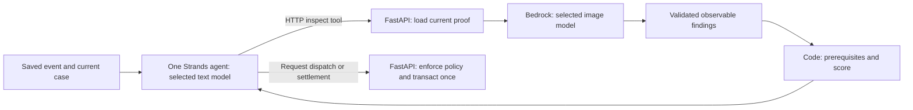

# Choosing Steward's models: what needs AI, what it costs, and what works

Reviewed September 13, 2026. The owner has changed the earlier “Sonnet for everything” decision: **use the least expensive model that passes the requirements for its job.** Steward still has one Strands agent. An image-inspection request is a bounded tool operation, not another autonomous agent.

This document owns the model-selection protocol referenced by the [PRD](PRD.md), [architecture](ARCHITECTURE.md), [build guide](BUILD_PLAN.md) and [evaluation](EVALUATION.md). It does not relax the couch, authority, payment or release requirements.

**Current result:** eight models completed the existing basic tool check. Five also received the same four photo comparisons. Only Sonnet matched all four expected photo outcomes. Three cheaper models incorrectly accepted partial cleanup. We therefore have credible cheaper text candidates, but no demonstrated cheaper replacement for the current photo inspector. The application default remains Sonnet; separate model settings and the complete text-workflow evaluation are still to build.

## 1. What we are paying a model to do

Think of the model as a worker we hire for a particular judgment. Ordinary code keeps the records, does arithmetic and enforces the rules. We should not pay a worker to add $60 and $12 or repeatedly check whether someone has clicked a button.

| Step in the product | What actually needs to happen | Model need and starting choice | What connects to what / build task |
|---|---|---|---|
| Receive a report or feed item | Validate fields, record who submitted it and save the image | No model for saving; do not charge for receiving a form | Resident/feed → FastAPI → Store and image storage; B2/B3 |
| Understand a messy description | Identify the object, reported location and possible hazards; preserve unknowns | Text candidate: Nova Micro or gpt-oss-20b; compare against Sonnet | Saved signal → bounded agent context → structured proposal → validated state tool; B4/B11 |
| Understand an intake photo | Extract visible object/hazard facts when the description is insufficient | Image-capable model required. Start with the Sonnet baseline; intake accuracy still needs its own cases | Stored image bytes → trusted Bedrock adapter → findings with evidence IDs → agent; B4. Completion-photo success does not prove intake classification |
| Find the location | Look up one of ten seeded addresses; later optionally call Amazon Location | No generative model to invent coordinates. Text interpretation may identify a supplied address, but lookup supplies coordinates | Geocode tool → fixture or flagged Amazon Location adapter → precision/provenance; B4/O2 |
| Find and connect related reports | Retrieve nearby candidates; decide whether two descriptions concern the same couch | Code retrieves candidates and detects exact duplicates; text model proposes ambiguous matches | Database relationships → candidate evidence → agent → guarded link operation; B4 |
| Work out who witnessed what | Compare reporter/source IDs, copied reports and observation times | No model for independence points or the 24-hour bonus | Stored source facts → scoring code; B1/B4 |
| Check a city record | Retrieve status and timestamps; reconcile a closed record with newer evidence | Lookup and time/score rules are code. The text agent interprets the conflict and chooses its next action | Fixture/live 311 tool → agent context → dispute/monitor tools; B4/O1 |
| Decide responsibility and work scope | Interpret couch versus hazard; propose a service and identify uncertainty | Text model proposes. Server boundary/category rules decide authority | Agent → jurisdiction/plan tools → stored policy and district geometry; B4/B5 |
| Price and arrange work | Compute $72, check vendor eligibility and funds, reserve once | No model for price/budget/permission. The text agent selects among eligible choices and requests dispatch | Agent → HTTP dispatch tool → transactional API ledger; B5/B10 |
| Crew accepts or checks in | Save a valid state change and coordinates | No model call | Crew form → actor-scoped API → job/event; B6 |
| Inspect partial or completed work | Compare before/after; report target, scene, hazard and remaining debris | Image model: retain Sonnet for the current prompt/fixtures. Re-evaluate cheaper candidates before replacing it | Agent requests inspection → API loads exact proof bytes → Bedrock vision → stored findings; B7 |
| Decide whether payment is allowed | Check image findings, GPS, time, reuse, score and current job | No model for the verification score, prerequisites or money movement. Image errors still matter because code relies on those findings | Trusted inspection → Python gates → idempotent settlement tool; B7/B9 |
| Ask for human help and resume | Explain the specific problem; load the actual operator decision on a new run | Text agent interprets next steps. API saves the choice; no AI runs while waiting | Exception → Operator Inbox → event → fresh context → agent; B8/B11/B12 |
| Explain the outcome | Show saved decisions, evidence and permitted next actions | Reuse the concise explanation from the decision. No separate “make it sound nice” model call | Persisted events/findings → API projections → React; P2–P6 |
| Keep the graph and context | Link issue → signals → evidence → job → proof → decision; retrieve current facts | No graph model, embedding model or summarizer required for the seeded V1. Use database relationships and bounded queries | Store → context builder → one agent; B1/B11. A larger search system needs evidence of a retrieval problem first |
| Host, trace, recover and reset | Run the software, retain events and show operational evidence | No model to poll, reset, render a map, authenticate or collect logs | AgentCore / application host / durable storage / CloudWatch; H1–H6 |

We need **text reasoning/tool use** and **image understanding**. Speech, video generation, image generation, embeddings, reranking, fine-tuning and a separate model that judges other models are not required by this product. The synthetic images already exist. A model family supporting a feature does not mean we need that feature.

## 2. Candidates and cost comparison

The live Bedrock catalog and system inference profiles were checked in `us-west-2`, followed by actual inference using the identifiers below. All eight worked through the existing Strands/Bedrock tool check. These are a bounded shortlist across Amazon, OpenAI, Mistral and Anthropic, not an exhaustive ranking of every model in Bedrock.

USD per million tokens; standard uncached input/output rates are **planning assumptions**, checked against AWS sources on September 13. “Input” is what we send; “output” is what the model generates. Region, inference profile, API, tier and image/reasoning billing can affect the bill. Do not substitute a model family name for the exact tested ID.

| Candidate | Exact tested model/profile ID | Input / output planning rate | Example: 5,000 text input + 500 output tokens | Role worth evaluating |
|---|---|---:|---:|---|
| Nova Micro | `us.amazon.nova-micro-v1:0` | $0.035 / $0.14 [A] | $0.000245 | Cheapest text candidate; cannot inspect images |
| Nova Lite | `us.amazon.nova-lite-v1:0` | $0.06 / $0.24 [A] | $0.000420 | Cheap text/vision candidate; current vision screen failed |
| gpt-oss-20b | `openai.gpt-oss-20b-1:0` | $0.07 / $0.30 [B] | $0.000500 | Low-cost text/tool candidate; cannot inspect images |
| Ministral 8B 3.0 | `mistral.ministral-3-8b-instruct` | $0.15 / $0.15 [C] | $0.000825 | Low output cost, text/image challenger; current vision screen failed |
| gpt-oss-120b | `openai.gpt-oss-120b-1:0` | $0.15 / $0.60 [B] | $0.001050 | Larger text challenger if smaller models miss domain judgments |
| Nova 2 Lite | `us.amazon.nova-2-lite-v1:0` | $0.30 / $2.50 [D] | $0.002750 | Reasoning/image challenger; current vision screen failed |
| Claude Haiku 4.5 | `global.anthropic.claude-haiku-4-5-20251001-v1:0` | $1 / $5 [E] | $0.007500 | Lower-cost Anthropic challenger; current vision screen failed |
| Claude Sonnet 4.6 | `global.anthropic.claude-sonnet-4-6` | $3 / $15 [D] | $0.022500 | Existing baseline; strongest result on our current photo screen |

Sources: [A — AWS Nova price/performance table](https://aws.amazon.com/blogs/machine-learning/prompting-for-the-best-price-performance/); [B — AWS gpt-oss price examples](https://aws.amazon.com/cn/blogs/china/access-amazon-bedrock-inference-mantle-litellm-gateway/); [C — Bedrock pricing, US Mistral standard rates](https://aws.amazon.com/bedrock/pricing/); [D — AWS Nova 2 Lite and Sonnet cost discussion](https://aws.amazon.com/blogs/machine-learning/pair-nova-2-lite-with-claude-for-cost-optimized-document-processing/); [E — AWS global versus geographic Claude pricing](https://aws.amazon.com/jp/blogs/news/amazon-bedrock-now-supports-japan-cross-region-inference/).

The gpt-oss examples in source B describe the Mantle endpoint; we tested the `bedrock-runtime` IDs above. Those dollar values remain estimates until the exact runtime tariff is verified before selecting on cost. Do not use the pricing page's Sydney rates as Oregon rates, or its **Safeguard** model rates as ordinary gpt-oss rates. Likewise, the global Haiku price is different from the US geographic profile price ($1.10/$5.50 in source E). A global profile permits routing outside the calling region; our current Sonnet baseline already uses one. Any deployment residency requirement must constrain the eligible profiles.

At the example volume, 1,000 text calls would be about **$0.25 on Micro versus $22.50 on Sonnet**. This demonstrates the price difference, not equal performance. Models tokenize differently, make different numbers of tool calls, and may need retries. Evaluate the **total cost of a correct completed case**, including failed attempts, rather than the cheapest token alone.

No direct Anthropic or OpenAI API subscription, self-hosted GPU, extra gateway service or new cloud account is needed for these candidates. They were invoked through the existing AWS/Bedrock setup. Larger frontier models and additional low-cost families can enter a later screen if these fail; a broad model tournament is not a prerequisite for building the couch workflow.

## 3. What we actually tested

Evidence: [public component-screen artifact](evaluations/2026-09-13-model-screen.json). It retains source/lock hashes, exact model IDs, region, prompts, image hashes, structured outputs, usage, latency and failed expectations. Original local artifacts are `.steward/model-screen-*-tools.json` and `.steward/model-screen-*-vision.json`. No source or application model default was changed for the experiment.

**Tool test:** one real two-cycle Strands invocation per candidate: request `current_time`, receive its result, produce a final reply. Maximum 256 output tokens per call; temperature 0. This proves basic integration, not correct issue matching, authority reasoning or compliance with every instruction. The existing checker does not grade timestamp-only formatting; Micro and Lite added extra words.

**Image test:** the unchanged prompt `51ffbcab39ca79c3`, strict `report_findings` schema/tool choice, temperature 0, maximum 1,024 output tokens. Each image model saw before→middle, before→after, before→unrelated and before→reused, once each. GPS/time inputs and photos were the frozen synthetic fixture. All failures were retained; no prompt tuning or selective reruns occurred in this comparison.

| Model | Basic tool round trip | Photo expectations matched | False acceptance of partial work | Median photo request, seconds |
|---|---|---|---|---:|
| Nova Micro | Passed | Not applicable: text only | Not tested | — |
| Nova Lite | Passed | 3/4 | **Yes**, marked area clear and scored 100 | 1.99 |
| gpt-oss-20b | Passed | Not applicable: text only | Not tested | — |
| gpt-oss-120b | Passed | Not applicable: text only | Not tested | — |
| Ministral 8B | Passed | 3/4 | **Yes**, marked area clear despite describing remaining bags/litter | 2.05 |
| Nova 2 Lite | Passed | 3/4 | No; marked area clear but hazard unknown blocked acceptance | 1.55 |
| Haiku 4.5 | Passed | 3/4 | **Yes**, marked area clear despite describing remaining bags/litter | 3.86 |
| Sonnet 4.6 | Passed | **4/4** | No; partial cleanup scored 90 | 7.09 |

There were no recorded request/schema errors in the twenty photo requests. Each photo model got the complete, unrelated and reused cases right. “False acceptance” means the existing verification predicate returned payable on the fixture; **no payment was executed**. A deterministic gate cannot repair a model incorrectly reporting that the sidewalk is clear.

The vision CLI deliberately reports `FAIL`/`passed: false` with `--repeats 1`, including Sonnet: its qualification gate requires at least three repeats. The 4/4 screen is not that gate. The earlier Sonnet **12/12** component qualification remains separately documented in [the vision spike report](evaluations/2026-09-13-vision-spike.md); it is neither a new result nor proof of the whole workflow.

This screen performed 16 model calls for eight tool round trips plus 20 image calls: 36 successful model requests. Usage multiplied by the table's standard planning rates is approximately **$0.09** for this screen, excluding earlier tests and infrastructure. This is an estimate, not an AWS invoice. It uses reported input/output tokens; exact image billing needs reconciliation, especially Nova 2 Lite's fixed per-image billing described in source D. All three denominators remain separate: component screen, twelve-inspection qualification and twenty-two-scenario workflow evaluation.

## 4. The proposed model arrangement

Start with two **configurable jobs**, not a model for every API endpoint:

1. **Text agent:** try Nova Micro and gpt-oss-20b first against the same frozen domain cases. Compare gpt-oss-120b, Nova Lite, Ministral, Nova 2 Lite or Haiku when the cheaper pair fails a required judgment. Sonnet is the reference and development fallback until another choice qualifies. One text model runs a given invocation; we do not switch models mid-conversation.
2. **Image inspector:** keep Sonnet for the existing completion-proof prompt. Use it as the initial candidate for intake vision, which still needs separate validation. A cheaper model replaces it only after meeting the same image gates. Three present candidates confidently missed remaining rubbish, so “use cheap vision and upgrade only if it says unsure” would not catch those failures.

The one text agent sees trusted structured photo findings and their evidence IDs, rather than needing to accept image bytes itself. FastAPI loads the real images and owns the inspection operation. A text-only candidate must never receive images through an unsupported interface. Both models remain Bedrock calls; AgentCore hosts the agent code and does not choose or pay for a model on our behalf.



A separate image request adds value because it has a distinct input and contract. Adding classifier, planner, explainer and reviewer calls to every event would add cost and integration work. Do those judgments in the existing agent turn unless measured failures justify separation. The graph is the connected stored records; context engineering is choosing the right records for the current question.

## 5. What builders must implement, and when

These are planned changes, not features already present. [M0 in the build guide](BUILD_PLAN.md#m0-select-models-by-job--initial-screen-complete-integration-and-qualification-open) coordinates them.

| Deliverable | How to build it | Dependencies and completion evidence |
|---|---|---|
| Independent model settings | Extend `config.py` with planned `BEDROCK_TEXT_MODEL_ID` and `BEDROCK_VISION_MODEL_ID`. Each falls back to existing `BEDROCK_MODEL_ID` for compatibility. Keep the default Sonnet until promotion is supported by evidence. Log the resolved ID, region and profile | Before B11/B7 integration; tests prove different IDs reach the correct clients and old single-model configuration still works |
| Correct call ownership | `core.py` builds one text-model agent. `vision.py` uses the image ID. B4 intake inspection and B7 completion inspection load persisted images through trusted API services. `vision_spike.py` logs the actual image ID; `bedrock_check.py` logs the actual text ID | B4/B7/B10/B11; no hidden second workflow, no model-controlled inspection facts, local/hosted parity |
| Small text quality cases | Freeze descriptions, related-issue candidates, official-record contradictions, missing addresses, hazards and next-action expectations before inference. Include copied witnesses and mixed couch/electrical hazards | Can author alongside B4. Grade structured proposals; do not award credit just because a downstream gate stopped a bad request |
| Role qualification | First use the small cases to reject unsuitable candidates. For image promotion run all four pairings × three repeats; then run the intake cases and existing negative tests. Publish every failure | B4/B7 before using a replacement in acceptance; unknowns cannot turn into “true,” partial must remain 90, complete 100, scene/reuse negatives denied |
| Workflow qualification | Run all sixteen API criteria for the proposed text+image pair; then the twenty-two frozen evaluation scenarios with the same configuration. Preserve both baseline and candidate outputs | B13 and P8 respectively. No cheaper configuration is called fully qualified until both gates pass |
| Usage/cost receipts | Save model/profile, role, invocation/evidence IDs, input/output/cache usage when supplied, latency, attempts, stop reason, prompt/tool/fixture versions and priced/unpriced status. Missing usage is unknown, not zero | B11/B12/P8; aggregate by completed case and role; dated rate assumptions separate from actual AWS billed spend |
| AWS permissions | Allow the exact selected models/profiles and required inference actions in the agent execution role and API inspector role. Recheck invocation in the deployment region and record cross-region scope | H2/H4; a catalog listing alone does not establish account access. H3 traces both text and image calls |

**Promotion rule:** zero false automatic accepts and all required expectations for the photo qualification; all sixteen acceptance criteria and all twenty-two required scenario outcomes for the proposed complete configuration. Report unnecessary escalation and latency as well as failures. A candidate that always asks a person to intervene is not a working replacement for the autonomous couch flow. If none qualifies, retain the baseline and report why. Use the measured cost of passing configurations to choose between them. Passing a small fixture set establishes only that set's result.

Any prompt, image-preprocessing, model, routing or tool-schema change creates a new version and requires the affected qualification to rerun. If improving the image prompt, clarify “clear” for the full work area, not merely the couch footprint, for all candidates; retain this failed baseline. Do not tune to filenames or embed expected answers. Add separate unseen partial/full examples to detect fixture overfitting, and keep their denominator distinct from the existing spike and twenty-two cases.

## 6. Cost controls that preserve the product

- **Call only for a reason.** No model for saving, checking in, polling, waiting, arithmetic or replaying an already completed effect. Make intake interpretation part of the current agent run rather than a chain of tiny paid requests.
- **Send the current case.** B11 includes policy, relevant evidence and successful prior effects with bounded history. Do not send the whole database or a growing transcript. Keep failed proof and current gating facts even when trimming context.
- **Read each unchanged image once per inspection version.** Reuse a stored result only for the same evidence hashes, work scope, model, prompt and schema versions. A new proof upload or changed scope must be inspected again; the latest accepted result cannot authorize different bytes.
- **Keep limits explicit.** Retain B11/B12's cycle/tool/deadline limits. Set output limits per job. Retry only transient failures within the invocation limit; invalid requests, denied permissions and policy denials do not earn unlimited retries.
- **No automatic “try until approved.”** Initial implementation uses one selected model per role. Any future fallback needs a recorded trigger, bounded attempt budget, preserved prior failure and independent evaluation. An expensive model cannot recover missing evidence. When evidence remains uncertain, stop for review.
- **Optimize prompts before extra services.** Use concise structured findings and saved explanations. Prompt caching, batch evaluation or lower inference tiers are later measurements, not assumed discounts. Verify the selected model's API support and minimum cache sizes before relying on them; live user interactions cannot wait for offline batches.
- **Keep two budgets distinct.** The seeded $500 district ledger is simulated cleanup money. AWS inference and hosting are real infrastructure spend. Neither the agent nor the district ledger can authorize an unlimited AWS bill. Start with per-invocation limits and usage receipts; set a separate explicit dollar cap before any larger model study.

Hosting, durable storage, CloudWatch, data transfer and optional service calls are additional costs. At demo traffic, a permanently running application can matter more than the difference between two inexpensive text models. H1/H4 must price the actual chosen topology; this model table is not a whole-project monthly budget.

## 7. Reproduce the current screen

Use the existing package environment and valid local AWS credentials. These commands send the synthetic fixture to Bedrock and incur inference charges. They do not change `.env` or the application default. Use a new artifact prefix for each run so failed outputs are never overwritten.

PowerShell example, changing only the candidate and output prefix:

```powershell
$env:BEDROCK_MODEL_ID = 'us.amazon.nova-lite-v1:0'
uv run --no-sync python -m agent.bedrock_check --out .steward/my-nova-lite-tools.json
uv run --no-sync python -m agent.vision_spike --repeats 1 --interval 1 --out .steward/my-nova-lite-screen.json
```

Run only the first command for the three text-only candidates. Use `--repeats 3` and a new output path for full vision qualification. The one-repeat vision command's nonzero exit is expected; inspect the per-pair expectations rather than changing the checker to call a screen a pass. After separate role settings are implemented, set/log the appropriate role variable as well; a lingering role override must not make a comparison silently test the wrong model.

The public artifact records the code/lock hashes used by this screen. The complete Steward evaluation command remains planned under P8; a generic time-tool success cannot substitute for it.
